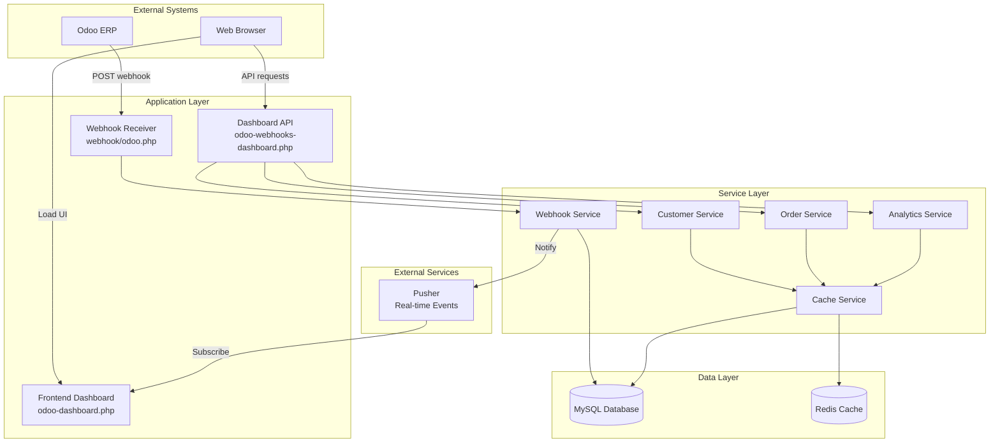

# Design Document: Odoo Webhook Dashboard Improvement

## Overview

This design refactors the Odoo webhook dashboard system from a monolithic 3000+ line API file into a maintainable, performant, and secure architecture. The improvement addresses critical code duplication, performance bottlenecks, and organizational issues while maintaining backward compatibility.

### Goals

1. Eliminate duplicate code and establish single source of truth
2. Improve response times from seconds to sub-200ms for 95% of requests
3. Reduce database queries from 10+ per request to 3 or fewer
4. Separate concerns into testable service layer components
5. Modernize frontend with proper build process and component structure
6. Implement comprehensive error handling and logging
7. Add caching layer to reduce database load
8. Maintain 100% backward compatibility with existing API consumers

### Non-Goals

1. Migrating from PHP to another language
2. Replacing MySQL with a different database
3. Rewriting the Odoo ERP integration protocol
4. Changing the Pusher real-time notification system

## Architecture

### High-Level Architecture



### Architecture Principles

1. **Separation of Concerns**: API controllers handle routing, services handle business logic
2. **Single Responsibility**: Each service manages one domain (webhooks, customers, orders, analytics)
3. **Dependency Injection**: Services receive dependencies through constructors
4. **Caching Strategy**: Cache-aside pattern with TTL-based expiration
5. **Backward Compatibility**: Maintain existing API contracts during refactoring


## Components and Interfaces

### 1. API Controller Layer

#### DashboardAPIController

The main API controller that routes requests to appropriate services.

**Location**: `reyaphp/api/odoo-webhooks-dashboard.php`

**Responsibilities**:
- Route incoming API requests to service methods
- Validate authentication and authorization
- Parse and validate request parameters
- Format service responses as JSON
- Handle HTTP status codes and headers

**Interface**:
```php
class DashboardAPIController {
    private WebhookService $webhookService;
    private CustomerService $customerService;
    private OrderService $orderService;
    private AnalyticsService $analyticsService;
    
    public function __construct(
        WebhookService $webhookService,
        CustomerService $customerService,
        OrderService $orderService,
        AnalyticsService $analyticsService
    );
    
    public function handleRequest(): void;
    private function authenticate(): bool;
    private function getAction(): string;
    private function jsonResponse(array $data, int $status = 200): void;
    private function errorResponse(string $message, int $status = 400): void;
}
```

**Key Methods**:
- `handleRequest()`: Main entry point that dispatches to action handlers
- `authenticate()`: Verifies session or API token
- `jsonResponse()`: Standardized JSON response formatting
- `errorResponse()`: Standardized error response formatting


### 2. Service Layer

#### WebhookService

Handles webhook processing, storage, and retry logic.

**Location**: `reyaphp/classes/OdooWebhookService.php`

**Responsibilities**:
- Process incoming webhook payloads
- Store webhooks in database
- Manage dead letter queue for failed webhooks
- Trigger real-time notifications via Pusher
- Update customer projection tables

**Interface**:
```php
class WebhookService {
    private Database $db;
    private CacheService $cache;
    private PusherService $pusher;
    
    public function processWebhook(array $payload): array;
    public function getWebhookById(int $id): ?array;
    public function listWebhooks(array $filters, int $page, int $limit): array;
    public function retryFailedWebhook(int $dlqId): array;
    public function getWebhookStats(): array;
    private function storeWebhook(array $payload): int;
    private function updateCustomerProjection(array $payload): void;
    private function sendToDeadLetterQueue(array $payload, string $error): void;
}
```

**Key Methods**:
- `processWebhook()`: Main webhook processing pipeline
- `listWebhooks()`: Paginated webhook listing with filters
- `retryFailedWebhook()`: Reprocess webhooks from DLQ
- `updateCustomerProjection()`: Update aggregated customer data


#### CustomerService

Manages customer data aggregation and lookups.

**Location**: `reyaphp/classes/OdooCustomerService.php`

**Responsibilities**:
- Query customer projection table for fast lookups
- Aggregate customer statistics from webhook data
- Rebuild customer projections when needed
- Provide customer search and filtering

**Interface**:
```php
class CustomerService {
    private Database $db;
    private CacheService $cache;
    
    public function getCustomerById(int $customerId): ?array;
    public function searchCustomers(string $query, int $page, int $limit): array;
    public function listCustomers(array $filters, int $page, int $limit): array;
    public function getCustomerStats(int $customerId): array;
    public function rebuildCustomerProjection(int $customerId): void;
    public function rebuildAllProjections(): void;
    private function calculateCustomerStats(int $customerId): array;
    private function updateProjectionTable(int $customerId, array $stats): void;
}
```

**Key Methods**:
- `getCustomerById()`: Fast lookup using projection table with cache
- `searchCustomers()`: Full-text search across customer data
- `rebuildCustomerProjection()`: Recalculate aggregated stats for one customer
- `calculateCustomerStats()`: Aggregate orders, invoices, and spending


#### OrderService

Manages order data, timelines, and status tracking.

**Location**: `reyaphp/classes/OdooOrderService.php`

**Responsibilities**:
- Query orders, invoices, slips, and BDOs
- Build order timelines from multiple webhook types
- Manage order notes and status overrides
- Provide order grouping and filtering

**Interface**:
```php
class OrderService {
    private Database $db;
    private CacheService $cache;
    
    public function getOrderById(string $orderId): ?array;
    public function listOrders(array $filters, int $page, int $limit): array;
    public function getOrderTimeline(string $orderId): array;
    public function getOrdersGroupedByStatus(): array;
    public function getTodayOrders(): array;
    public function addOrderNote(string $orderId, string $note, int $userId): void;
    public function overrideOrderStatus(string $orderId, string $status, int $userId): void;
    private function aggregateOrderEvents(string $orderId): array;
    private function getRelatedInvoices(string $orderId): array;
    private function getRelatedSlips(string $orderId): array;
}
```

**Key Methods**:
- `getOrderTimeline()`: Aggregate all events for an order chronologically
- `getOrdersGroupedByStatus()`: Group orders by status with counts
- `addOrderNote()`: Add manual notes to order history
- `overrideOrderStatus()`: Manual status override with audit trail


#### AnalyticsService

Provides dashboard statistics and reporting.

**Location**: `reyaphp/classes/OdooAnalyticsService.php`

**Responsibilities**:
- Calculate daily, weekly, and monthly statistics
- Generate sales reports by salesperson
- Provide real-time dashboard metrics
- Send daily summary notifications

**Interface**:
```php
class AnalyticsService {
    private Database $db;
    private CacheService $cache;
    
    public function getDashboardStats(): array;
    public function getDailySummary(string $date): array;
    public function getSalespersonStats(array $filters): array;
    public function getRevenueByPeriod(string $startDate, string $endDate): array;
    public function getTopCustomers(int $limit): array;
    public function getActivityLog(array $filters, int $page, int $limit): array;
    public function generateDailySummaryPreview(): array;
    public function sendDailySummary(): bool;
    private function calculateMetrics(string $startDate, string $endDate): array;
    private function compareToPreviousPeriod(array $current, string $period): array;
}
```

**Key Methods**:
- `getDashboardStats()`: Real-time stats with 5-minute cache
- `getDailySummary()`: Comprehensive daily report with trends
- `getSalespersonStats()`: Performance metrics per salesperson
- `sendDailySummary()`: Automated daily report via LINE/Telegram


#### CacheService

Manages caching layer with Redis or file-based fallback.

**Location**: `reyaphp/classes/CacheService.php`

**Responsibilities**:
- Store and retrieve cached data
- Handle cache invalidation
- Manage TTL-based expiration
- Provide cache warming capabilities

**Interface**:
```php
class CacheService {
    private ?Redis $redis;
    private string $cacheDir;
    
    public function __construct(?Redis $redis = null, string $cacheDir = '/tmp/cache');
    
    public function get(string $key): mixed;
    public function set(string $key, mixed $value, int $ttl = 300): bool;
    public function delete(string $key): bool;
    public function deletePattern(string $pattern): int;
    public function has(string $key): bool;
    public function remember(string $key, callable $callback, int $ttl = 300): mixed;
    public function flush(): bool;
    private function generateKey(string $key): string;
    private function isRedisAvailable(): bool;
}
```

**Key Methods**:
- `remember()`: Cache-aside pattern - get from cache or execute callback
- `deletePattern()`: Invalidate multiple keys matching pattern
- `generateKey()`: Consistent key generation with namespace
- `isRedisAvailable()`: Fallback to file cache if Redis unavailable

**Cache Keys Strategy**:
- `odoo:stats:dashboard` - Dashboard statistics (5 min TTL)
- `odoo:customer:{id}` - Customer details (1 hour TTL)
- `odoo:orders:today` - Today's orders (5 min TTL)
- `odoo:timeline:{orderId}` - Order timeline (15 min TTL)
- `odoo:analytics:daily:{date}` - Daily summary (1 day TTL)


### 3. Data Access Layer

#### Database Query Optimization

**Current Issues**:
- N+1 queries in loops
- Multiple separate COUNT queries
- Repeated JSON_EXTRACT operations
- No query result caching

**Optimization Strategies**:

1. **Eliminate N+1 Queries**:
```php
// Before: N+1 queries
foreach ($orders as $order) {
    $customer = $db->query("SELECT * FROM customers WHERE id = ?", [$order['customer_id']]);
}

// After: Single JOIN query
$orders = $db->query("
    SELECT o.*, c.name, c.email, c.phone
    FROM orders o
    LEFT JOIN customers c ON o.customer_id = c.id
    WHERE o.date >= ?
", [$startDate]);
```

2. **Consolidate COUNT Queries**:
```php
// Before: Multiple queries
$totalOrders = $db->query("SELECT COUNT(*) FROM orders WHERE date = ?", [$date]);
$totalInvoices = $db->query("SELECT COUNT(*) FROM invoices WHERE date = ?", [$date]);
$totalRevenue = $db->query("SELECT SUM(amount) FROM orders WHERE date = ?", [$date]);

// After: Single query
$stats = $db->query("
    SELECT 
        COUNT(DISTINCT o.id) as total_orders,
        COUNT(DISTINCT i.id) as total_invoices,
        SUM(o.amount) as total_revenue
    FROM orders o
    LEFT JOIN invoices i ON o.id = i.order_id AND i.date = ?
    WHERE o.date = ?
", [$date, $date])[0];
```

3. **Optimize JSON Extraction**:
```php
// Before: Repeated JSON_EXTRACT in WHERE clause
$results = $db->query("
    SELECT * FROM webhooks 
    WHERE JSON_EXTRACT(payload, '$.customer.id') = ?
", [$customerId]);

// After: Use virtual generated column (one-time migration)
ALTER TABLE webhooks ADD COLUMN customer_id INT AS (JSON_EXTRACT(payload, '$.customer.id')) STORED;
CREATE INDEX idx_webhooks_customer_id ON webhooks(customer_id);

// Then query the indexed column
$results = $db->query("SELECT * FROM webhooks WHERE customer_id = ?", [$customerId]);
```


4. **Customer Projection Table**:
```sql
-- Optimized projection table for fast customer lookups
CREATE TABLE odoo_customer_projection (
    customer_id INT PRIMARY KEY,
    customer_name VARCHAR(255),
    customer_email VARCHAR(255),
    customer_phone VARCHAR(50),
    total_orders INT DEFAULT 0,
    total_spent DECIMAL(10,2) DEFAULT 0,
    last_order_date DATETIME,
    first_order_date DATETIME,
    customer_tier VARCHAR(50),
    updated_at TIMESTAMP DEFAULT CURRENT_TIMESTAMP ON UPDATE CURRENT_TIMESTAMP,
    INDEX idx_customer_name (customer_name),
    INDEX idx_last_order (last_order_date),
    INDEX idx_tier (customer_tier)
) ENGINE=InnoDB DEFAULT CHARSET=utf8mb4;
```

**Update Strategy**:
- Update projection on webhook processing (real-time)
- Rebuild projection daily via cron job (consistency check)
- Fallback to webhook log if projection data missing


## Data Models

### Webhook Log

**Table**: `odoo_webhooks_log`

```sql
CREATE TABLE odoo_webhooks_log (
    id INT AUTO_INCREMENT PRIMARY KEY,
    webhook_type VARCHAR(50) NOT NULL,
    odoo_id VARCHAR(100),
    customer_id INT,
    order_id VARCHAR(100),
    payload JSON NOT NULL,
    received_at TIMESTAMP DEFAULT CURRENT_TIMESTAMP,
    processed_at TIMESTAMP NULL,
    status ENUM('pending', 'processed', 'failed') DEFAULT 'pending',
    error_message TEXT,
    retry_count INT DEFAULT 0,
    INDEX idx_webhook_type (webhook_type),
    INDEX idx_customer_id (customer_id),
    INDEX idx_order_id (order_id),
    INDEX idx_status (status),
    INDEX idx_received_at (received_at)
) ENGINE=InnoDB DEFAULT CHARSET=utf8mb4;
```

**Fields**:
- `id`: Auto-increment primary key
- `webhook_type`: Type of webhook (order, invoice, slip, bdo)
- `odoo_id`: Odoo entity ID
- `customer_id`: Extracted customer ID for fast filtering
- `order_id`: Extracted order ID for fast filtering
- `payload`: Full JSON payload from Odoo
- `received_at`: Timestamp when webhook received
- `processed_at`: Timestamp when processing completed
- `status`: Processing status
- `error_message`: Error details if failed
- `retry_count`: Number of retry attempts


### Dead Letter Queue

**Table**: `odoo_webhook_dlq`

```sql
CREATE TABLE odoo_webhook_dlq (
    id INT AUTO_INCREMENT PRIMARY KEY,
    webhook_log_id INT,
    payload JSON NOT NULL,
    error_message TEXT NOT NULL,
    retry_count INT DEFAULT 0,
    last_retry_at TIMESTAMP NULL,
    created_at TIMESTAMP DEFAULT CURRENT_TIMESTAMP,
    resolved_at TIMESTAMP NULL,
    status ENUM('pending', 'retrying', 'resolved', 'abandoned') DEFAULT 'pending',
    FOREIGN KEY (webhook_log_id) REFERENCES odoo_webhooks_log(id),
    INDEX idx_status (status),
    INDEX idx_created_at (created_at)
) ENGINE=InnoDB DEFAULT CHARSET=utf8mb4;
```

**Fields**:
- `id`: Auto-increment primary key
- `webhook_log_id`: Reference to original webhook
- `payload`: Original webhook payload
- `error_message`: Detailed error information
- `retry_count`: Number of retry attempts
- `last_retry_at`: Last retry timestamp
- `created_at`: When added to DLQ
- `resolved_at`: When successfully reprocessed
- `status`: Current DLQ status


### Order Notes

**Table**: `odoo_order_notes`

```sql
CREATE TABLE odoo_order_notes (
    id INT AUTO_INCREMENT PRIMARY KEY,
    order_id VARCHAR(100) NOT NULL,
    user_id INT NOT NULL,
    note TEXT NOT NULL,
    created_at TIMESTAMP DEFAULT CURRENT_TIMESTAMP,
    INDEX idx_order_id (order_id),
    INDEX idx_created_at (created_at)
) ENGINE=InnoDB DEFAULT CHARSET=utf8mb4;
```

**Fields**:
- `id`: Auto-increment primary key
- `order_id`: Odoo order ID
- `user_id`: User who added the note
- `note`: Note content
- `created_at`: Timestamp

### Order Status Overrides

**Table**: `odoo_order_status_overrides`

```sql
CREATE TABLE odoo_order_status_overrides (
    id INT AUTO_INCREMENT PRIMARY KEY,
    order_id VARCHAR(100) NOT NULL,
    user_id INT NOT NULL,
    old_status VARCHAR(50),
    new_status VARCHAR(50) NOT NULL,
    reason TEXT,
    created_at TIMESTAMP DEFAULT CURRENT_TIMESTAMP,
    INDEX idx_order_id (order_id),
    INDEX idx_created_at (created_at)
) ENGINE=InnoDB DEFAULT CHARSET=utf8mb4;
```

**Fields**:
- `id`: Auto-increment primary key
- `order_id`: Odoo order ID
- `user_id`: User who made the override
- `old_status`: Previous status
- `new_status`: New status
- `reason`: Reason for override
- `created_at`: Timestamp


### Activity Log

**Table**: `odoo_activity_log`

```sql
CREATE TABLE odoo_activity_log (
    id INT AUTO_INCREMENT PRIMARY KEY,
    user_id INT,
    action VARCHAR(100) NOT NULL,
    entity_type VARCHAR(50),
    entity_id VARCHAR(100),
    details JSON,
    ip_address VARCHAR(45),
    user_agent TEXT,
    created_at TIMESTAMP DEFAULT CURRENT_TIMESTAMP,
    INDEX idx_user_id (user_id),
    INDEX idx_action (action),
    INDEX idx_entity (entity_type, entity_id),
    INDEX idx_created_at (created_at)
) ENGINE=InnoDB DEFAULT CHARSET=utf8mb4;
```

**Fields**:
- `id`: Auto-increment primary key
- `user_id`: User who performed action
- `action`: Action type (view, update, retry, etc.)
- `entity_type`: Type of entity (order, customer, webhook)
- `entity_id`: Entity identifier
- `details`: Additional action details as JSON
- `ip_address`: User IP address
- `user_agent`: User browser/client
- `created_at`: Timestamp


### Frontend Architecture

#### Component Structure

The frontend will be refactored from a monolithic file into modular components:

**File Structure**:
```
reyaphp/
├── odoo-dashboard.php (Main HTML shell)
├── assets/
│   ├── js/
│   │   ├── odoo-dashboard/
│   │   │   ├── main.js (Entry point)
│   │   │   ├── api-client.js (API communication)
│   │   │   ├── components/
│   │   │   │   ├── stats-widget.js
│   │   │   │   ├── webhook-list.js
│   │   │   │   ├── customer-search.js
│   │   │   │   ├── order-timeline.js
│   │   │   │   └── analytics-chart.js
│   │   │   ├── utils/
│   │   │   │   ├── date-formatter.js
│   │   │   │   ├── currency-formatter.js
│   │   │   │   └── sanitizer.js
│   │   │   └── state/
│   │   │       └── dashboard-state.js
│   │   └── odoo-dashboard.min.js (Built bundle)
│   └── css/
│       └── odoo-dashboard.css
```

#### API Client Module

**Location**: `assets/js/odoo-dashboard/api-client.js`

```javascript
class OdooAPIClient {
    constructor(baseUrl) {
        this.baseUrl = baseUrl;
        this.cache = new Map();
    }
    
    async request(action, params = {}) {
        const cacheKey = `${action}:${JSON.stringify(params)}`;
        
        if (this.cache.has(cacheKey)) {
            const cached = this.cache.get(cacheKey);
            if (Date.now() - cached.timestamp < 60000) {
                return cached.data;
            }
        }
        
        const response = await fetch(this.baseUrl, {
            method: 'POST',
            headers: {
                'Content-Type': 'application/json',
                'X-Requested-With': 'XMLHttpRequest'
            },
            body: JSON.stringify({ action, ...params })
        });
        
        if (!response.ok) {
            throw new Error(`API Error: ${response.status}`);
        }
        
        const data = await response.json();
        
        this.cache.set(cacheKey, {
            data,
            timestamp: Date.now()
        });
        
        return data;
    }
    
    async getStats() {
        return this.request('stats');
    }
    
    async listWebhooks(filters, page, limit) {
        return this.request('list', { filters, page, limit });
    }
    
    async getCustomer(customerId) {
        return this.request('customer_detail', { customer_id: customerId });
    }
    
    async getOrderTimeline(orderId) {
        return this.request('order_timeline', { order_id: orderId });
    }
}
```


#### Dashboard State Management

**Location**: `assets/js/odoo-dashboard/state/dashboard-state.js`

```javascript
class DashboardState {
    constructor() {
        this.state = {
            stats: null,
            webhooks: [],
            selectedWebhook: null,
            filters: {},
            loading: false,
            error: null
        };
        this.listeners = [];
    }
    
    subscribe(listener) {
        this.listeners.push(listener);
        return () => {
            this.listeners = this.listeners.filter(l => l !== listener);
        };
    }
    
    setState(updates) {
        this.state = { ...this.state, ...updates };
        this.notify();
    }
    
    notify() {
        this.listeners.forEach(listener => listener(this.state));
    }
    
    getState() {
        return this.state;
    }
}
```

#### Real-time Updates with Pusher

```javascript
class DashboardRealtimeUpdates {
    constructor(pusher, dashboardState) {
        this.pusher = pusher;
        this.state = dashboardState;
        this.channel = null;
    }
    
    connect() {
        this.channel = this.pusher.subscribe('odoo-webhooks');
        
        this.channel.bind('webhook-received', (data) => {
            this.handleNewWebhook(data);
        });
        
        this.channel.bind('webhook-processed', (data) => {
            this.handleWebhookProcessed(data);
        });
        
        this.channel.bind('stats-updated', (data) => {
            this.handleStatsUpdate(data);
        });
    }
    
    handleNewWebhook(data) {
        const currentWebhooks = this.state.getState().webhooks;
        this.state.setState({
            webhooks: [data.webhook, ...currentWebhooks]
        });
        this.showNotification('New webhook received', 'info');
    }
    
    handleWebhookProcessed(data) {
        const currentWebhooks = this.state.getState().webhooks;
        const updated = currentWebhooks.map(w => 
            w.id === data.webhook_id ? { ...w, status: 'processed' } : w
        );
        this.state.setState({ webhooks: updated });
    }
    
    handleStatsUpdate(data) {
        this.state.setState({ stats: data.stats });
    }
    
    showNotification(message, type) {
        // Toast notification implementation
    }
    
    disconnect() {
        if (this.channel) {
            this.channel.unbind_all();
            this.pusher.unsubscribe('odoo-webhooks');
        }
    }
}
```


#### Build Process

**Tool**: Simple concatenation and minification using PHP or npm

**Option 1: PHP-based build** (no Node.js required):
```php
// build-dashboard.php
$files = [
    'assets/js/odoo-dashboard/utils/sanitizer.js',
    'assets/js/odoo-dashboard/utils/date-formatter.js',
    'assets/js/odoo-dashboard/utils/currency-formatter.js',
    'assets/js/odoo-dashboard/state/dashboard-state.js',
    'assets/js/odoo-dashboard/api-client.js',
    'assets/js/odoo-dashboard/components/stats-widget.js',
    'assets/js/odoo-dashboard/components/webhook-list.js',
    'assets/js/odoo-dashboard/components/customer-search.js',
    'assets/js/odoo-dashboard/components/order-timeline.js',
    'assets/js/odoo-dashboard/components/analytics-chart.js',
    'assets/js/odoo-dashboard/main.js'
];

$combined = '';
foreach ($files as $file) {
    $combined .= file_get_contents($file) . "\n";
}

// Simple minification (remove comments and extra whitespace)
$minified = preg_replace('/\/\*[\s\S]*?\*\/|\/\/.*$/m', '', $combined);
$minified = preg_replace('/\s+/', ' ', $minified);

file_put_contents('assets/js/odoo-dashboard.min.js', $minified);
```

**Option 2: npm-based build** (if Node.js available):
```json
{
  "scripts": {
    "build": "rollup -c",
    "watch": "rollup -c -w"
  },
  "devDependencies": {
    "rollup": "^3.0.0",
    "rollup-plugin-terser": "^7.0.2"
  }
}
```


## Error Handling

### Error Response Format

All API endpoints return standardized error responses:

```json
{
  "success": false,
  "error": {
    "code": "VALIDATION_ERROR",
    "message": "Invalid customer ID format",
    "details": {
      "field": "customer_id",
      "expected": "integer",
      "received": "string"
    },
    "request_id": "req_abc123xyz",
    "timestamp": "2024-01-15T10:30:00Z"
  }
}
```

### Error Categories

**Client Errors (4xx)**:
- `VALIDATION_ERROR` (400): Invalid input parameters
- `AUTHENTICATION_ERROR` (401): Missing or invalid authentication
- `AUTHORIZATION_ERROR` (403): Insufficient permissions
- `NOT_FOUND` (404): Resource not found
- `RATE_LIMIT_EXCEEDED` (429): Too many requests

**Server Errors (5xx)**:
- `DATABASE_ERROR` (500): Database query failed
- `EXTERNAL_SERVICE_ERROR` (502): Odoo API unavailable
- `PROCESSING_ERROR` (500): Webhook processing failed
- `CACHE_ERROR` (500): Cache service unavailable

### Error Logging

**Log Format**:
```php
[2024-01-15 10:30:00] ERROR: Database query failed
Request ID: req_abc123xyz
User ID: 42
Action: customer_detail
Query: SELECT * FROM customers WHERE id = ?
Parameters: [12345]
Error: SQLSTATE[42S22]: Column not found
Stack Trace:
  #0 /path/to/Database.php(45): PDO->execute()
  #1 /path/to/CustomerService.php(78): Database->query()
  #2 /path/to/DashboardAPIController.php(120): CustomerService->getCustomerById()
```

**Log Levels**:
- `DEBUG`: Detailed diagnostic information
- `INFO`: General informational messages
- `WARNING`: Warning messages for recoverable issues
- `ERROR`: Error messages for failures
- `CRITICAL`: Critical errors requiring immediate attention


### Retry Logic

**Webhook Processing Retry**:
```php
class WebhookRetryStrategy {
    private const MAX_RETRIES = 3;
    private const BASE_DELAY = 1; // seconds
    
    public function shouldRetry(int $attemptNumber, \Exception $error): bool {
        if ($attemptNumber >= self::MAX_RETRIES) {
            return false;
        }
        
        // Don't retry validation errors
        if ($error instanceof ValidationException) {
            return false;
        }
        
        // Retry transient errors
        return $error instanceof DatabaseException 
            || $error instanceof NetworkException;
    }
    
    public function getDelay(int $attemptNumber): int {
        // Exponential backoff: 1s, 2s, 4s
        return self::BASE_DELAY * pow(2, $attemptNumber - 1);
    }
}
```

**Implementation**:
```php
public function processWebhookWithRetry(array $payload): array {
    $strategy = new WebhookRetryStrategy();
    $attempt = 0;
    $lastError = null;
    
    while ($attempt < 3) {
        $attempt++;
        
        try {
            return $this->processWebhook($payload);
        } catch (\Exception $e) {
            $lastError = $e;
            
            if (!$strategy->shouldRetry($attempt, $e)) {
                break;
            }
            
            $delay = $strategy->getDelay($attempt);
            $this->log("Retrying webhook processing in {$delay}s (attempt {$attempt})");
            sleep($delay);
        }
    }
    
    // All retries failed, send to DLQ
    $this->sendToDeadLetterQueue($payload, $lastError->getMessage());
    throw $lastError;
}
```


### Input Validation

**Validation Rules**:
```php
class RequestValidator {
    private array $rules = [
        'customer_id' => ['type' => 'integer', 'min' => 1],
        'order_id' => ['type' => 'string', 'pattern' => '/^[A-Z0-9-]+$/'],
        'page' => ['type' => 'integer', 'min' => 1, 'default' => 1],
        'limit' => ['type' => 'integer', 'min' => 1, 'max' => 100, 'default' => 20],
        'date' => ['type' => 'date', 'format' => 'Y-m-d'],
        'status' => ['type' => 'enum', 'values' => ['pending', 'processed', 'failed']]
    ];
    
    public function validate(array $input, array $required = []): array {
        $validated = [];
        $errors = [];
        
        foreach ($required as $field) {
            if (!isset($input[$field])) {
                $errors[$field] = "Field '{$field}' is required";
            }
        }
        
        foreach ($input as $field => $value) {
            if (!isset($this->rules[$field])) {
                continue; // Ignore unknown fields
            }
            
            $rule = $this->rules[$field];
            
            try {
                $validated[$field] = $this->validateField($field, $value, $rule);
            } catch (ValidationException $e) {
                $errors[$field] = $e->getMessage();
            }
        }
        
        if (!empty($errors)) {
            throw new ValidationException('Validation failed', $errors);
        }
        
        return $validated;
    }
    
    private function validateField(string $field, $value, array $rule) {
        // Type validation
        if (isset($rule['type'])) {
            $value = $this->castType($value, $rule['type']);
        }
        
        // Range validation
        if (isset($rule['min']) && $value < $rule['min']) {
            throw new ValidationException("Value must be at least {$rule['min']}");
        }
        
        if (isset($rule['max']) && $value > $rule['max']) {
            throw new ValidationException("Value must be at most {$rule['max']}");
        }
        
        // Pattern validation
        if (isset($rule['pattern']) && !preg_match($rule['pattern'], $value)) {
            throw new ValidationException("Value does not match required pattern");
        }
        
        // Enum validation
        if (isset($rule['values']) && !in_array($value, $rule['values'])) {
            throw new ValidationException("Value must be one of: " . implode(', ', $rule['values']));
        }
        
        return $value;
    }
}
```


### Security Measures

**SQL Injection Prevention**:
```php
// Always use prepared statements
class Database {
    public function query(string $sql, array $params = []): array {
        $stmt = $this->pdo->prepare($sql);
        $stmt->execute($params);
        return $stmt->fetchAll(PDO::FETCH_ASSOC);
    }
}

// NEVER concatenate user input into SQL
// BAD: "SELECT * FROM orders WHERE id = " . $_GET['id']
// GOOD: $db->query("SELECT * FROM orders WHERE id = ?", [$_GET['id']])
```

**XSS Prevention**:
```php
class OutputSanitizer {
    public static function escape(string $value): string {
        return htmlspecialchars($value, ENT_QUOTES | ENT_HTML5, 'UTF-8');
    }
    
    public static function escapeJson($data): string {
        return json_encode($data, JSON_HEX_TAG | JSON_HEX_AMP | JSON_HEX_APOS | JSON_HEX_QUOT);
    }
}

// In templates
echo OutputSanitizer::escape($customerName);
```

**Rate Limiting**:
```php
class RateLimiter {
    private CacheService $cache;
    private int $maxRequests = 100;
    private int $windowSeconds = 60;
    
    public function checkLimit(string $userId): bool {
        $key = "rate_limit:{$userId}";
        $current = (int) $this->cache->get($key) ?? 0;
        
        if ($current >= $this->maxRequests) {
            return false;
        }
        
        $this->cache->set($key, $current + 1, $this->windowSeconds);
        return true;
    }
    
    public function getRemainingRequests(string $userId): int {
        $key = "rate_limit:{$userId}";
        $current = (int) $this->cache->get($key) ?? 0;
        return max(0, $this->maxRequests - $current);
    }
}
```

**Authentication**:
```php
class AuthenticationMiddleware {
    public function authenticate(): ?int {
        // Check session
        if (isset($_SESSION['user_id'])) {
            return (int) $_SESSION['user_id'];
        }
        
        // Check API token
        $token = $this->getBearerToken();
        if ($token) {
            return $this->validateApiToken($token);
        }
        
        return null;
    }
    
    private function getBearerToken(): ?string {
        $headers = getallheaders();
        if (isset($headers['Authorization'])) {
            if (preg_match('/Bearer\s+(.+)/', $headers['Authorization'], $matches)) {
                return $matches[1];
            }
        }
        return null;
    }
}
```


## Testing Strategy

### Unit Testing

**Framework**: PHPUnit 9.6+

**Test Structure**:
```
reyaphp/tests/
├── Unit/
│   ├── Services/
│   │   ├── WebhookServiceTest.php
│   │   ├── CustomerServiceTest.php
│   │   ├── OrderServiceTest.php
│   │   ├── AnalyticsServiceTest.php
│   │   └── CacheServiceTest.php
│   ├── Validators/
│   │   └── RequestValidatorTest.php
│   └── Utils/
│       └── OutputSanitizerTest.php
├── Integration/
│   ├── API/
│   │   └── DashboardAPITest.php
│   └── Webhook/
│       └── WebhookProcessingTest.php
└── Performance/
    └── QueryPerformanceTest.php
```

**Example Unit Test**:
```php
class CustomerServiceTest extends TestCase {
    private CustomerService $service;
    private Database $db;
    private CacheService $cache;
    
    protected function setUp(): void {
        $this->db = $this->createMock(Database::class);
        $this->cache = $this->createMock(CacheService::class);
        $this->service = new CustomerService($this->db, $this->cache);
    }
    
    public function testGetCustomerByIdReturnsCustomerFromCache(): void {
        $customerId = 123;
        $expectedCustomer = ['id' => 123, 'name' => 'Test Customer'];
        
        $this->cache->expects($this->once())
            ->method('get')
            ->with("odoo:customer:{$customerId}")
            ->willReturn($expectedCustomer);
        
        $this->db->expects($this->never())
            ->method('query');
        
        $result = $this->service->getCustomerById($customerId);
        
        $this->assertEquals($expectedCustomer, $result);
    }
    
    public function testGetCustomerByIdFallsBackToDatabase(): void {
        $customerId = 123;
        $expectedCustomer = ['id' => 123, 'name' => 'Test Customer'];
        
        $this->cache->expects($this->once())
            ->method('get')
            ->willReturn(null);
        
        $this->db->expects($this->once())
            ->method('query')
            ->willReturn([$expectedCustomer]);
        
        $this->cache->expects($this->once())
            ->method('set')
            ->with("odoo:customer:{$customerId}", $expectedCustomer, 3600);
        
        $result = $this->service->getCustomerById($customerId);
        
        $this->assertEquals($expectedCustomer, $result);
    }
}
```


### Integration Testing

**Example Integration Test**:
```php
class DashboardAPITest extends TestCase {
    private Database $db;
    
    protected function setUp(): void {
        $this->db = new Database(/* test database config */);
        $this->seedTestData();
    }
    
    public function testListWebhooksReturnsFilteredResults(): void {
        $_SESSION['user_id'] = 1;
        $_POST = [
            'action' => 'list',
            'filters' => ['status' => 'processed'],
            'page' => 1,
            'limit' => 10
        ];
        
        ob_start();
        require 'api/odoo-webhooks-dashboard.php';
        $output = ob_get_clean();
        
        $response = json_decode($output, true);
        
        $this->assertTrue($response['success']);
        $this->assertArrayHasKey('data', $response);
        $this->assertArrayHasKey('pagination', $response);
        $this->assertLessThanOrEqual(10, count($response['data']));
        
        foreach ($response['data'] as $webhook) {
            $this->assertEquals('processed', $webhook['status']);
        }
    }
    
    public function testUnauthorizedRequestReturns401(): void {
        unset($_SESSION['user_id']);
        $_POST = ['action' => 'stats'];
        
        ob_start();
        require 'api/odoo-webhooks-dashboard.php';
        $output = ob_get_clean();
        
        $response = json_decode($output, true);
        
        $this->assertFalse($response['success']);
        $this->assertEquals('AUTHENTICATION_ERROR', $response['error']['code']);
    }
}
```


### Performance Testing

**Query Performance Benchmarks**:
```php
class QueryPerformanceTest extends TestCase {
    private Database $db;
    
    public function testCustomerLookupPerformance(): void {
        $startTime = microtime(true);
        
        $service = new CustomerService($this->db, new CacheService());
        $customer = $service->getCustomerById(123);
        
        $duration = (microtime(true) - $startTime) * 1000; // Convert to ms
        
        $this->assertLessThan(100, $duration, 
            "Customer lookup should complete in under 100ms, took {$duration}ms");
    }
    
    public function testDashboardStatsPerformance(): void {
        $startTime = microtime(true);
        
        $service = new AnalyticsService($this->db, new CacheService());
        $stats = $service->getDashboardStats();
        
        $duration = (microtime(true) - $startTime) * 1000;
        
        $this->assertLessThan(200, $duration,
            "Dashboard stats should complete in under 200ms, took {$duration}ms");
    }
    
    public function testOrderTimelineQueryCount(): void {
        $queryCounter = new QueryCounter($this->db);
        
        $service = new OrderService($queryCounter, new CacheService());
        $timeline = $service->getOrderTimeline('ORD-12345');
        
        $this->assertLessThanOrEqual(3, $queryCounter->getCount(),
            "Order timeline should execute 3 or fewer queries");
    }
}
```

### Property-Based Testing

Property-based tests will be written using a simple property testing approach for PHP:

**Test Configuration**:
- Minimum 100 iterations per property test
- Each test tagged with feature name and property number
- Tests validate universal properties across random inputs

**Example Property Test Structure**:
```php
/**
 * Feature: odoo-webhook-dashboard-improvement, Property 1: Cache consistency
 * 
 * For any valid customer ID, retrieving customer data twice should return
 * identical results (cache consistency).
 */
class CacheConsistencyPropertyTest extends TestCase {
    public function testCacheConsistencyProperty(): void {
        $service = new CustomerService($this->db, $this->cache);
        
        for ($i = 0; $i < 100; $i++) {
            $customerId = rand(1, 10000);
            
            // First retrieval
            $result1 = $service->getCustomerById($customerId);
            
            // Second retrieval (should use cache)
            $result2 = $service->getCustomerById($customerId);
            
            $this->assertEquals($result1, $result2,
                "Customer data should be consistent across cache retrievals");
        }
    }
}
```


## Correctness Properties

A property is a characteristic or behavior that should hold true across all valid executions of a system—essentially, a formal statement about what the system should do. Properties serve as the bridge between human-readable specifications and machine-verifiable correctness guarantees.

### Property Reflection Analysis

After analyzing all acceptance criteria, several properties were identified as redundant or overlapping:

- **Query performance properties** (3.6, 20.1, 20.2, 20.4, 20.5) can be consolidated into a single comprehensive performance property
- **Cache behavior properties** (4.2, 4.5) both test cache consistency and can be combined
- **Error handling properties** (5.1, 5.2, 5.3) all relate to error response format and can be unified
- **Webhook processing properties** (7.1, 7.3, 7.4, 7.5, 7.6) cover the complete webhook lifecycle and should be kept separate as they test different aspects

The following properties represent the unique, non-redundant correctness guarantees for the system:


### Property 1: API Backward Compatibility

*For any* valid API request that worked before refactoring, the same request should produce an equivalent response after refactoring, maintaining the same data structure and status codes.

**Validates: Requirements 1.3, 19.1**

### Property 2: Service Routing Correctness

*For any* valid API action parameter, the Dashboard API should route the request to exactly one service method, and that service method should correspond to the action's domain (webhooks → WebhookService, customers → CustomerService, etc.).

**Validates: Requirements 2.2**

### Property 3: Query Count Bounded

*For any* API endpoint request, the total number of database queries executed should be 3 or fewer, regardless of the size of the result set.

**Validates: Requirements 3.1, 3.5**

### Property 4: Response Time Performance

*For any* API endpoint request under normal load, 95% of requests should complete in under 200ms, with health checks completing in under 50ms and customer lookups in under 100ms.

**Validates: Requirements 3.6, 20.1, 20.2, 20.4**

### Property 5: Cache Consistency

*For any* cacheable data request, retrieving the same data multiple times within the TTL period should return identical results, and after cache invalidation, subsequent requests should return fresh data from the database.

**Validates: Requirements 4.2, 4.5**

### Property 6: Error Response Format

*For any* error condition (client error or server error), the API should return a JSON response with a standardized structure containing success=false, error code, error message, request ID, and timestamp, with appropriate HTTP status codes (4xx for client errors, 5xx for server errors).

**Validates: Requirements 5.1, 5.2, 5.3**

### Property 7: Retry with Exponential Backoff

*For any* transient failure (database timeout, network error), the system should retry the operation up to 3 times with exponentially increasing delays (1s, 2s, 4s), and non-transient failures (validation errors) should not be retried.

**Validates: Requirements 5.5, 7.4**

### Property 8: Input Validation

*For any* API request parameter, the system should validate the parameter against its expected type, format, and constraints, rejecting invalid values with a VALIDATION_ERROR response and accepting valid values for processing.

**Validates: Requirements 6.1**

### Property 9: Output Sanitization

*For any* string value returned in API responses or rendered in HTML, special characters (<, >, &, ', ") should be properly escaped to prevent XSS attacks.

**Validates: Requirements 6.3**

### Property 10: Webhook Acknowledgment Speed

*For any* incoming webhook from Odoo, the system should acknowledge receipt (return HTTP 200) within 2 seconds, regardless of processing complexity.

**Validates: Requirements 7.1, 20.5**

### Property 11: Failed Webhook to DLQ

*For any* webhook that fails processing after all retry attempts, the system should store the webhook payload and error details in the Dead Letter Queue with status='pending' and retry_count reflecting the number of attempts.

**Validates: Requirements 7.3, 13.1**

### Property 12: Customer Projection Update

*For any* customer-related webhook (order, invoice, payment) that is successfully processed, the system should update the corresponding customer record in the Customer_Projection table with the latest aggregated statistics (total orders, total spent, last order date).

**Validates: Requirements 7.5, 10.2**

### Property 13: Webhook Processing Logging

*For any* webhook processing attempt (successful or failed), the system should create a log entry containing webhook ID, status, processing duration, and timestamp.

**Validates: Requirements 7.6, 18.3**

### Property 14: Field Selection

*For any* API request that includes a 'fields' parameter, the response should contain only the requested fields, reducing payload size and improving performance.

**Validates: Requirements 9.1**

### Property 15: ISO 8601 Timestamps

*For any* timestamp value in API responses, the format should conform to ISO 8601 standard (YYYY-MM-DDTHH:MM:SSZ).

**Validates: Requirements 9.4**

### Property 16: Pagination Metadata

*For any* paginated API response, the response should include metadata with current page, total pages, total count, and has_next/has_previous indicators.

**Validates: Requirements 9.6**

### Property 17: Customer Projection Fallback

*For any* customer ID, if the Customer_Projection table does not contain data for that customer, the system should fall back to calculating statistics from the webhook log and return the same data structure as if the projection existed.

**Validates: Requirements 10.4**

### Property 18: Order Timeline Completeness

*For any* order ID, the order timeline should include all related events from webhooks (order creation, payment, fulfillment, delivery), manual notes, and status overrides, sorted chronologically by timestamp.

**Validates: Requirements 11.1, 11.3**

### Property 19: Trend Calculation

*For any* analytics request with a time period, the system should calculate trends by comparing the current period's metrics to the previous period's metrics of equal length, returning percentage change and direction (up/down).

**Validates: Requirements 12.5**

### Property 20: DLQ Retry with Original Payload

*For any* Dead Letter Queue item that is retried, the system should reprocess the webhook using the exact original payload stored in the DLQ, not fetching fresh data from Odoo.

**Validates: Requirements 13.4**

### Property 21: Real-time Notification Broadcast

*For any* webhook that is successfully processed, the system should broadcast a Pusher event to the 'odoo-webhooks' channel with the webhook data, triggering real-time UI updates for connected dashboard clients.

**Validates: Requirements 14.1**

### Property 22: Notification Batching

*For any* sequence of rapid webhook arrivals (more than 10 per second), the system should batch notifications into groups and send them at most once per second to prevent overwhelming dashboard clients.

**Validates: Requirements 14.5**

