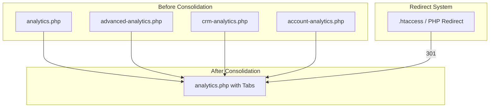

.# Design Document: File Consolidation

## Overview

ลดความซ้ำซ้อนของไฟล์และฟีเจอร์ในโปรเจค Pharmacy LINE CRM โดยการ:
1. ลบไฟล์ที่ซ้ำกัน 100%
2. รวมไฟล์เวอร์ชัน (v2, v3) เป็นไฟล์เดียว
3. รวมหน้าที่มีฟังก์ชันคล้ายกันเป็นหน้าเดียวแบบ Tab-based UI
4. ลบไฟล์ LIFF เก่าที่ root level (ใช้ SPA ใน liff/ folder แทน)
5. สร้างระบบ Redirect สำหรับ URL เก่า

**เป้าหมาย:** ลดจำนวนไฟล์ PHP จาก ~100 ไฟล์เหลือ ~50 ไฟล์

## Architecture



## Components and Interfaces

### 1. Tab-based Page Component

สร้าง reusable tab component สำหรับหน้าที่รวมหลายฟีเจอร์:

```php
// includes/components/tabs.php
function renderTabs($tabs, $activeTab) {
    $html = '<div class="tabs-container">';
    $html .= '<div class="tabs-nav">';
    foreach ($tabs as $key => $tab) {
        $active = ($key === $activeTab) ? 'active' : '';
        $html .= "<a href='?tab={$key}' class='tab-item {$active}'>";
        $html .= "<i class='{$tab['icon']}'></i> {$tab['label']}";
        $html .= "</a>";
    }
    $html .= '</div></div>';
    return $html;
}
```

### 2. Redirect Handler

สร้างระบบ redirect สำหรับ URL เก่า:

```php
// includes/redirects.php
$redirects = [
    // Analytics
    'advanced-analytics.php' => 'analytics.php?tab=advanced',
    'crm-analytics.php' => 'analytics.php?tab=crm',
    'account-analytics.php' => 'analytics.php?tab=account',
    
    // Dashboard
    'executive-dashboard.php' => 'dashboard.php?tab=executive',
    'crm-dashboard.php' => 'dashboard.php?tab=crm',
    
    // AI Chat
    'ai-chatbot.php' => 'ai-chat.php?tab=chatbot',
    'ai-chat-settings.php' => 'ai-chat.php?tab=settings',
    
    // Broadcast
    'broadcast-catalog.php' => 'broadcast.php?tab=catalog',
    'broadcast-products.php' => 'broadcast.php?tab=products',
    'broadcast-stats.php' => 'broadcast.php?tab=stats',
    
    // Rich Menu
    'dynamic-rich-menu.php' => 'rich-menu.php?tab=dynamic',
    'rich-menu-switch.php' => 'rich-menu.php?tab=switch',
    
    // Video Call
    'video-call-v2.php' => 'video-call.php',
    'video-call-simple.php' => 'video-call.php',
    'video-call-pro.php' => 'video-call.php',
    
    // LIFF (redirect to SPA)
    'liff-shop.php' => 'liff/index.php?page=shop',
    'liff-shop-v3.php' => 'liff/index.php?page=shop',
    'liff-checkout.php' => 'liff/index.php?page=checkout',
    'liff-my-orders.php' => 'liff/index.php?page=orders',
    'liff-points-history.php' => 'liff/index.php?page=points',
    'liff-redeem-points.php' => 'liff/index.php?page=redeem',
    'liff-video-call.php' => 'liff/index.php?page=video-call',
    'liff-member-card.php' => 'liff/index.php?page=member',
    // ... more LIFF redirects
    
    // Membership
    'admin-rewards.php' => 'membership.php?tab=rewards',
    'admin-points-settings.php' => 'membership.php?tab=settings',
    
    // Settings
    'line-accounts.php' => 'settings.php?tab=line',
    'telegram.php' => 'settings.php?tab=telegram',
    'email-settings.php' => 'settings.php?tab=email',
    'notification-settings.php' => 'settings.php?tab=notifications',
    'consent-management.php' => 'settings.php?tab=consent',
    'quick-access-settings.php' => 'settings.php?tab=quick-access',
    
    // Pharmacy
    'pharmacist-dashboard.php' => 'pharmacy.php?tab=dashboard',
    'pharmacists.php' => 'pharmacy.php?tab=pharmacists',
    'drug-interactions.php' => 'pharmacy.php?tab=interactions',
    'dispense-drugs.php' => 'pharmacy.php?tab=dispense',
    
    // Inventory
    'inventory/stock-movements.php' => 'inventory/index.php?tab=movements',
    'inventory/stock-adjustment.php' => 'inventory/index.php?tab=adjustment',
    'inventory/low-stock.php' => 'inventory/index.php?tab=low-stock',
    'inventory/reports.php' => 'inventory/index.php?tab=reports',
    
    // Procurement
    'inventory/purchase-orders.php' => 'procurement.php?tab=po',
    'inventory/goods-receive.php' => 'procurement.php?tab=gr',
    'inventory/suppliers.php' => 'procurement.php?tab=suppliers',
    
    // Shop Settings
    'shop/liff-shop-settings.php' => 'shop/settings.php?tab=liff',
    'shop/promotion-settings.php' => 'shop/settings.php?tab=promotions',
    
    // Scheduled
    'scheduled-reports.php' => 'scheduled.php?tab=reports',
];

function handleRedirect() {
    global $redirects;
    $currentFile = basename($_SERVER['PHP_SELF']);
    
    if (isset($redirects[$currentFile])) {
        $newUrl = $redirects[$currentFile];
        // Preserve query parameters
        if (!empty($_SERVER['QUERY_STRING'])) {
            $newUrl .= (strpos($newUrl, '?') !== false ? '&' : '?') . $_SERVER['QUERY_STRING'];
        }
        header("Location: {$newUrl}", true, 301);
        exit;
    }
}
```

### 3. Consolidated Page Structure

ตัวอย่างโครงสร้างหน้าที่รวมแล้ว:

```php
// analytics.php (consolidated)
<?php
require_once 'config/config.php';
require_once 'includes/components/tabs.php';

$tabs = [
    'overview' => ['label' => 'ภาพรวม', 'icon' => 'fas fa-chart-line'],
    'advanced' => ['label' => 'วิเคราะห์ขั้นสูง', 'icon' => 'fas fa-chart-bar'],
    'crm' => ['label' => 'CRM', 'icon' => 'fas fa-users'],
    'account' => ['label' => 'แยกตามบอท', 'icon' => 'fas fa-robot'],
];

$activeTab = $_GET['tab'] ?? 'overview';
$pageTitle = 'สถิติรวม';

require_once 'includes/header.php';
echo renderTabs($tabs, $activeTab);

// Load content based on active tab
switch ($activeTab) {
    case 'advanced':
        include 'includes/analytics/advanced.php';
        break;
    case 'crm':
        include 'includes/analytics/crm.php';
        break;
    case 'account':
        include 'includes/analytics/account.php';
        break;
    default:
        include 'includes/analytics/overview.php';
}

require_once 'includes/footer.php';
```

## Data Models

### File Consolidation Map

| Category | Files to Remove | Consolidated File |
|----------|-----------------|-------------------|
| Analytics | advanced-analytics.php, crm-analytics.php, account-analytics.php | analytics.php |
| Dashboard | executive-dashboard.php, crm-dashboard.php | dashboard.php |
| AI Chat | ai-chatbot.php, ai-chat-settings.php | ai-chat.php |
| Broadcast | broadcast-catalog.php, broadcast-products.php, broadcast-stats.php | broadcast.php |
| Rich Menu | dynamic-rich-menu.php, rich-menu-switch.php | rich-menu.php |
| Video Call | video-call-v2.php, video-call-simple.php | video-call.php (from video-call-pro.php) |
| LIFF | 24 liff-*.php files | liff/index.php (SPA) |
| Membership | admin-rewards.php, admin-points-settings.php | membership.php |
| Settings | line-accounts.php, telegram.php, email-settings.php, notification-settings.php, consent-management.php, quick-access-settings.php | settings.php |
| Pharmacy | pharmacist-dashboard.php, pharmacists.php, drug-interactions.php, dispense-drugs.php | pharmacy.php |
| Inventory | stock-movements.php, stock-adjustment.php, low-stock.php, reports.php | inventory/index.php |
| Procurement | purchase-orders.php, goods-receive.php, suppliers.php | procurement.php |
| Shop Settings | liff-shop-settings.php, promotion-settings.php | shop/settings.php |
| Scheduled | scheduled-reports.php | scheduled.php |
| Drip Campaign | drip-campaign-edit.php | drip-campaigns.php (modal) |
| Products | products-grid.php | shop/products.php (view toggle) |

### Files to Delete (Duplicates)

| File | Reason |
|------|--------|
| users_new.php | Duplicate of users.php |
| shop/orders_new.php | Duplicate of shop/orders.php |
| shop/order-detail-new.php | Duplicate of shop/order-detail.php |
| t.php | Test file |
| test.php | Test file |
| broadcast-catalog.php | Old version (keep v2) |
| flex-builder.php | Old version (keep v2) |
| messages-v2.php | Merge into messages.php |


## Correctness Properties

*A property is a characteristic or behavior that should hold true across all valid executions of a system-essentially, a formal statement about what the system should do. Properties serve as the bridge between human-readable specifications and machine-verifiable correctness guarantees.*

### Property 1: Menu URLs Point to Existing Files

*For any* menu item in the sidebar configuration, the URL path SHALL point to an existing PHP file in the project.

**Validates: Requirements 7.1, 7.2, 7.3, 7.4**

### Property 2: Redirect Preserves Query Parameters

*For any* redirect from an old URL to a new consolidated URL, all query parameters from the original request SHALL be preserved in the redirected URL.

**Validates: Requirements 8.1, 8.2**

### Property 3: Redirect Uses HTTP 301

*For any* redirect from an old URL to a new consolidated URL, the HTTP response status code SHALL be 301 (Permanent Redirect).

**Validates: Requirements 8.3**

### Property 4: Tab-based Pages Contain All Required Tabs

*For any* consolidated page with tab-based UI, the page SHALL render all tabs as specified in the requirements for that page.

**Validates: Requirements 3.1, 4.1, 10.1, 12.1, 13.1, 15.1, 17.1, 18.1, 19.1, 20.1, 21.1, 22.1**

### Property 5: Old LIFF URLs Redirect to SPA

*For any* old LIFF URL (liff-*.php at root level), accessing the URL SHALL redirect to liff/index.php with the appropriate page parameter.

**Validates: Requirements 5.3**

### Property 6: Duplicate Files Are Removed

*For any* file marked as duplicate in the consolidation plan, the file SHALL NOT exist in the project after consolidation.

**Validates: Requirements 1.1, 1.2, 1.3, 1.4, 2.1, 2.2, 2.3, 2.4, 2.5**

---

## Error Handling

### Invalid Tab Parameter
- ถ้า tab parameter ไม่ถูกต้อง → แสดง tab แรก (default)
- ถ้า tab parameter ว่าง → แสดง tab แรก

### Missing Redirect Target
- ถ้าไฟล์ปลายทางไม่มี → แสดง 404 error page
- Log error สำหรับ debugging

### Query Parameter Conflicts
- ถ้า query parameter ซ้ำกัน → ใช้ค่าจาก original URL
- Preserve all parameters ที่ไม่ conflict

---

## Testing Strategy

### Unit Tests
- ทดสอบ redirect function กับ URL ต่างๆ
- ทดสอบ tab rendering function
- ทดสอบ query parameter preservation

### Property-Based Tests (PHPUnit with Faker)
- **Property 1**: Generate random menu items, verify URLs point to existing files
- **Property 2**: Generate random query parameters, verify preservation after redirect
- **Property 3**: Test all redirect URLs return 301 status
- **Property 4**: Verify all consolidated pages contain required tabs
- **Property 5**: Test all old LIFF URLs redirect correctly
- **Property 6**: Verify duplicate files don't exist

### Integration Tests
- ทดสอบ navigation flow หลังจาก consolidation
- ทดสอบ bookmark URLs ยังทำงานได้
- ทดสอบ menu rendering ถูกต้อง

---

## Implementation Phases

### Phase 1: ลบไฟล์ซ้ำ (Low Risk)
1. ลบ users_new.php, shop/orders_new.php, shop/order-detail-new.php
2. ลบ t.php, test.php
3. ลบ New folder/ directory

### Phase 2: รวมไฟล์เวอร์ชัน (Low Risk)
1. Rename broadcast-catalog-v2.php → broadcast-catalog.php
2. Rename flex-builder-v2.php → flex-builder.php
3. Rename video-call-pro.php → video-call.php
4. ลบไฟล์เวอร์ชันเก่า

### Phase 3: ลบไฟล์ LIFF เก่า (Medium Risk)
1. สร้าง redirect rules สำหรับ liff-*.php
2. ลบไฟล์ liff-*.php ที่ root level
3. อัพเดท references ใน menu

### Phase 4: รวมหน้า Analytics & Dashboard (Medium Risk)
1. สร้าง tab component
2. รวม analytics files
3. รวม dashboard files
4. สร้าง redirect rules

### Phase 5: รวมหน้าอื่นๆ (Medium Risk)
1. รวม AI Chat, Broadcast, Rich Menu
2. รวม Membership, Settings, Pharmacy
3. รวม Inventory, Procurement
4. รวม Shop Settings, Scheduled

### Phase 6: อัพเดท Menu & Cleanup (Low Risk)
1. อัพเดท includes/header.php
2. ลบ user/ folder pages ที่ซ้ำซ้อน
3. Final testing

---

## Menu Structure After Consolidation

```
📊 Insights & Overview
├── Dashboard (dashboard.php) - tabs: executive, crm
├── Analytics (analytics.php) - tabs: overview, advanced, crm, account
└── Audit Logs (activity-logs.php)

🏥 Clinical Station
├── Unified Care Chat (inbox.php)
├── Video Call (video-call.php)
├── Pharmacy (pharmacy.php) - tabs: dashboard, pharmacists, interactions, dispense
└── Medical Copilot AI (ai-chat.php) - tabs: chat, chatbot, settings, studio

👤 Patient & Journey
├── EHR (users.php)
├── Membership (membership.php) - tabs: members, rewards, settings
├── Care Journey
│   ├── Broadcast (broadcast.php) - tabs: send, catalog, products, stats
│   ├── Drip Campaign (drip-campaigns.php)
│   └── Scheduled (scheduled.php) - tabs: messages, reports
└── Digital Front Door
    ├── Rich Menu (rich-menu.php) - tabs: static, dynamic, switch
    └── LIFF Settings (liff-settings.php)

📦 Supply & Revenue
├── Billing & Orders (shop/orders.php)
├── Inventory (inventory/index.php) - tabs: stock, movements, adjustment, low-stock, reports
├── Procurement (procurement.php) - tabs: po, gr, suppliers
└── Products (shop/products.php) - view toggle: list, grid

⚙️ Facility Setup
├── Shop Settings (shop/settings.php) - tabs: general, liff, promotions
├── Staff & Roles (admin-users.php)
├── Settings (settings.php) - tabs: line, telegram, email, notifications, consent, quick-access
└── Templates (templates.php)
```
