# Design Document: LIFF Telepharmacy Redesign

## Overview

ระบบ LIFF Telepharmacy Redesign เป็น Single Page Application (SPA) ที่ทำงานภายใน LINE App ผ่าน LINE Front-end Framework (LIFF) โดยออกแบบให้เป็น Mobile-First, Performance-Optimized และมี Premium UI/UX สำหรับร้านขายยาออนไลน์ที่ครอบคลุม E-commerce, CRM, และ Telemedicine

### Design Goals
1. **Performance**: First Contentful Paint < 1.5s, Time to Interactive < 3s
2. **Mobile-First**: Touch-friendly (44px min), Responsive, Safe area support
3. **Consistency**: Unified design system with Medical Green (#11B0A6) palette
4. **Offline Support**: Service Worker caching, Graceful degradation
5. **Accessibility**: WCAG 2.1 AA compliance

## Architecture

### High-Level Architecture

```
┌─────────────────────────────────────────────────────────────────┐
│                        LINE App                                  │
│  ┌───────────────────────────────────────────────────────────┐  │
│  │                    LIFF Application                        │  │
│  │  ┌─────────────────────────────────────────────────────┐  │  │
│  │  │              App Shell (SPA Router)                  │  │  │
│  │  │  ┌─────────┬─────────┬─────────┬─────────┬───────┐  │  │  │
│  │  │  │  Home   │  Shop   │  Cart   │ Orders  │Profile│  │  │  │
│  │  │  │Dashboard│  Page   │Checkout │ History │ Page  │  │  │  │
│  │  │  └─────────┴─────────┴─────────┴─────────┴───────┘  │  │  │
│  │  │  ┌─────────────────────────────────────────────────┐  │  │  │
│  │  │  │           Shared Components                      │  │  │  │
│  │  │  │  Header | BottomNav | ProductCard | Skeleton    │  │  │  │
│  │  │  └─────────────────────────────────────────────────┘  │  │  │
│  │  └─────────────────────────────────────────────────────┘  │  │
│  │                          │                                 │  │
│  │                    LIFF SDK v2                             │  │
│  │              (Auth, Profile, sendMessages)                 │  │
│  └───────────────────────────────────────────────────────────┘  │
└─────────────────────────────────────────────────────────────────┘
                              │
                              ▼
┌─────────────────────────────────────────────────────────────────┐
│                      Backend Services                            │
│  ┌─────────────┐  ┌─────────────┐  ┌─────────────────────────┐  │
│  │  REST API   │  │  Webhook    │  │    WebRTC Signaling     │  │
│  │  (PHP)      │  │  Handler    │  │    (Video Call)         │  │
│  └─────────────┘  └─────────────┘  └─────────────────────────┘  │
│         │                │                      │                │
│         ▼                ▼                      ▼                │
│  ┌─────────────────────────────────────────────────────────────┐│
│  │                     MySQL Database                           ││
│  │  users | orders | products | carts | appointments | ...      ││
│  └─────────────────────────────────────────────────────────────┘│
└─────────────────────────────────────────────────────────────────┘
```

### SPA Router Architecture

```
liff/
├── index.php                 # Entry point & Router
├── assets/
│   ├── css/
│   │   └── liff-app.css      # Unified styles
│   └── js/
│       ├── liff-app.js       # Main SPA controller
│       ├── router.js         # Client-side router
│       ├── store.js          # State management
│       └── components/       # Reusable components
│           ├── skeleton.js
│           ├── product-card.js
│           ├── bottom-nav.js
│           └── ...
├── pages/                    # Page modules
│   ├── home.js
│   ├── shop.js
│   ├── checkout.js
│   ├── orders.js
│   ├── member-card.js
│   ├── video-call.js
│   └── ...
└── api/                      # Backend APIs
    ├── products.php
    ├── cart.php
    ├── orders.php
    ├── member.php
    └── ...
```

## Flow Diagrams

### User Journey Flow
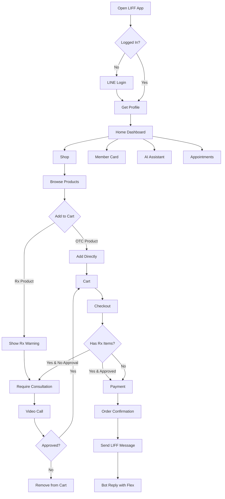

### Drug Interaction Check Flow
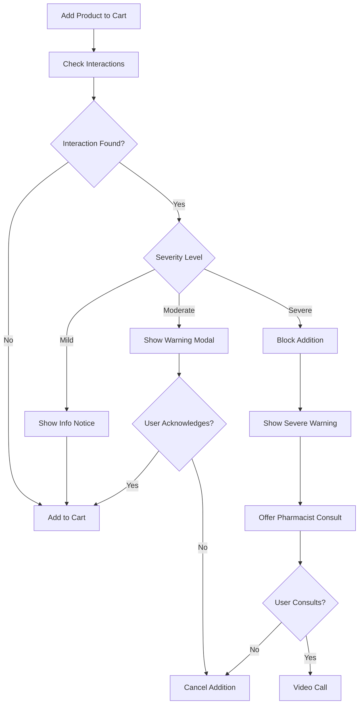

### Prescription Approval Flow
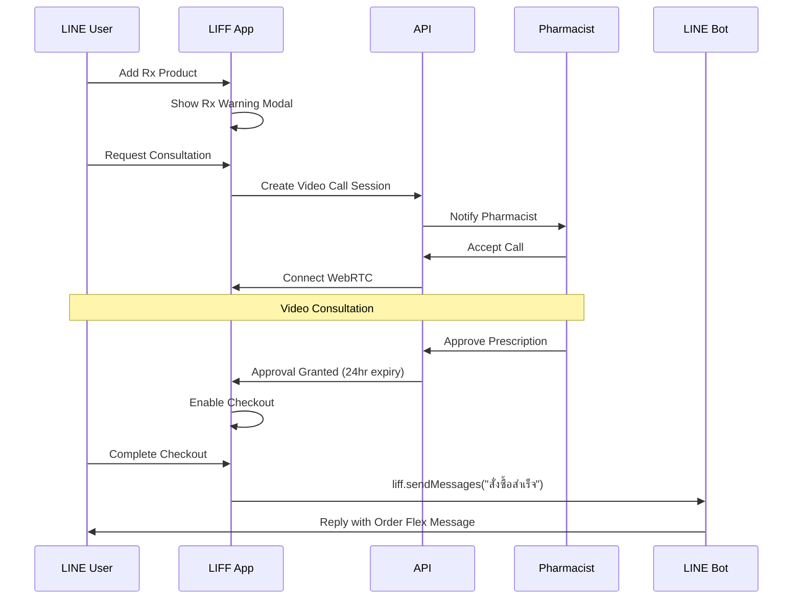

### LIFF-to-Bot Message Flow
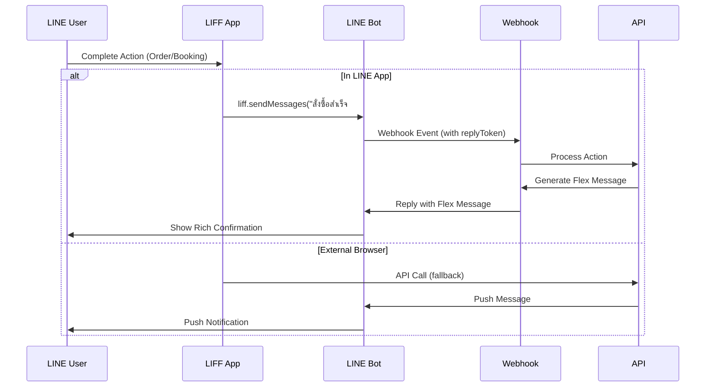

### Checkout Flow
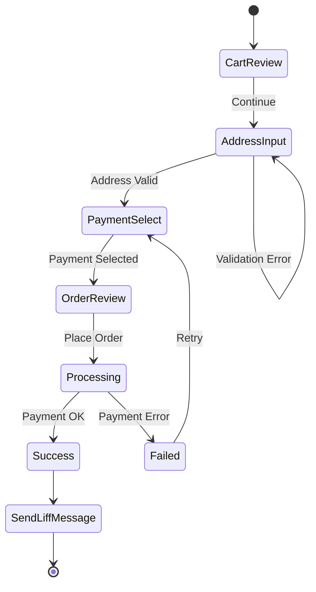

### Member Card & Points Flow
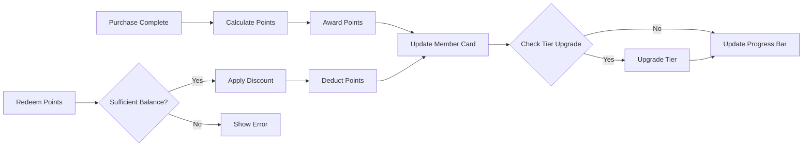

### Loyalty Points Earning Flow
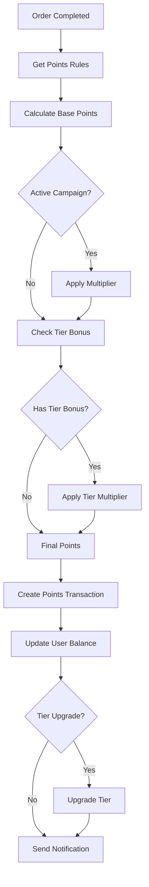

### Rewards Redemption Flow
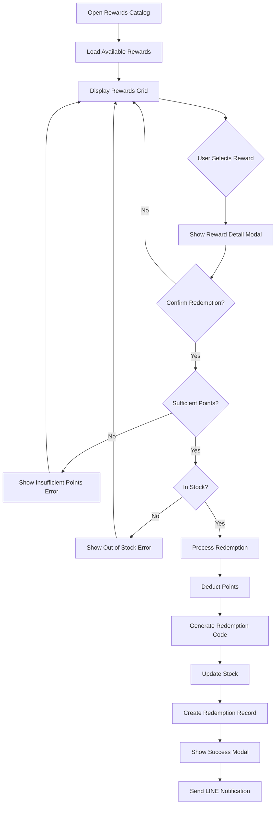

### Points Transaction History Flow
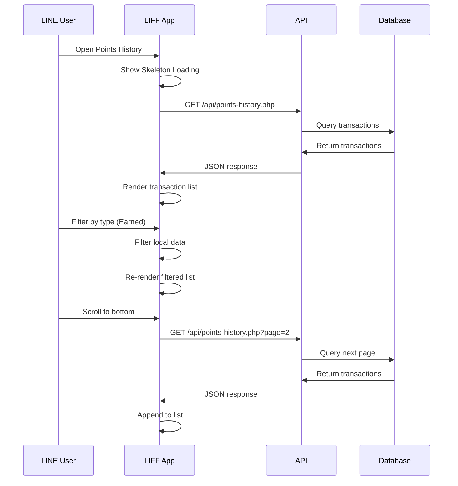

### Admin Rewards Management Flow
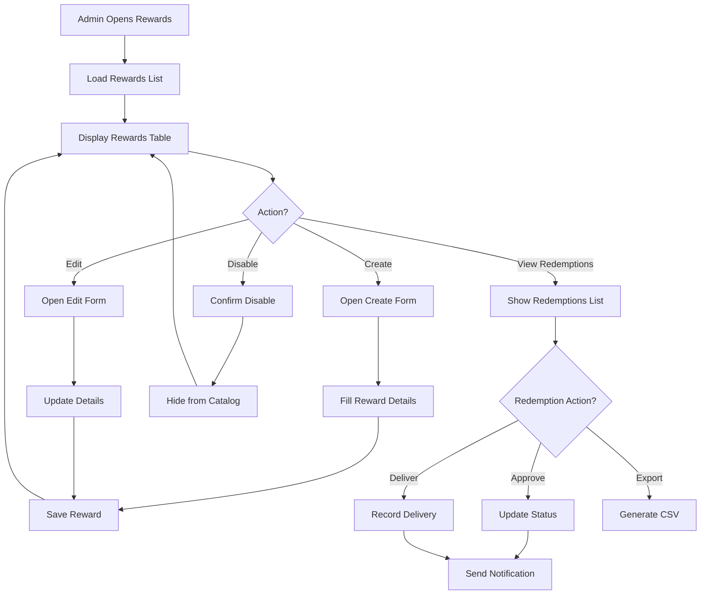

### Points Dashboard Flow
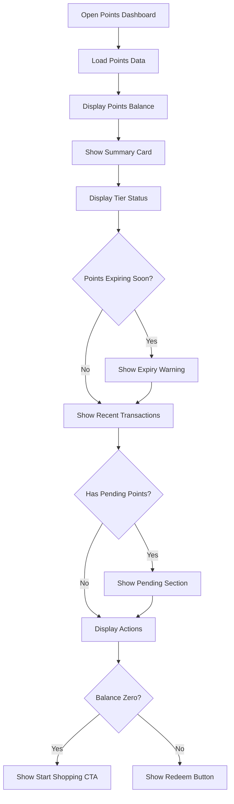

### Points Earning Calculation Flow
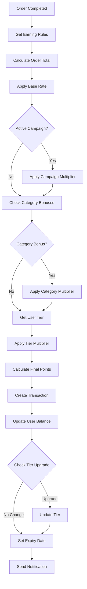

### Points Expiry Check Flow
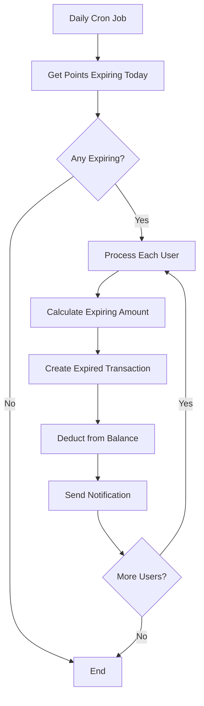

### Admin Points Rules Configuration Flow
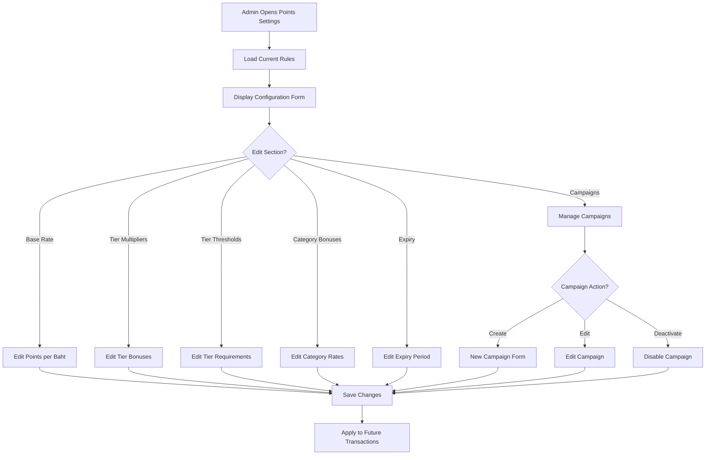

## Components and Interfaces

### Core Components

#### 1. App Shell Component
```javascript
class AppShell {
    constructor(config) {
        this.liffId = config.liffId;
        this.accountId = config.accountId;
        this.router = new Router();
        this.store = new Store();
    }
    
    async init() {
        await this.initLiff();
        this.renderShell();
        this.router.start();
    }
    
    async initLiff() {
        await liff.init({ liffId: this.liffId });
        if (liff.isLoggedIn()) {
            this.store.setProfile(await liff.getProfile());
        }
    }
}
```

#### 2. Router Component
```javascript
class Router {
    routes = {
        '/': 'home',
        '/shop': 'shop',
        '/checkout': 'checkout',
        '/orders': 'orders',
        '/member': 'member-card',
        '/video-call': 'video-call',
        '/appointments': 'appointments',
        '/profile': 'profile',
        '/wishlist': 'wishlist',
        '/coupons': 'coupons',
        '/health-profile': 'health-profile',
        '/notifications': 'notifications'
    };
    
    navigate(path, params = {}) {
        history.pushState(params, '', path);
        this.render(path);
    }
    
    render(path) {
        const page = this.routes[path] || 'home';
        this.loadPage(page);
    }
}
```

#### 3. Product Card Component
```javascript
class ProductCard {
    render(product) {
        return `
        <div class="product-card" data-id="${product.id}">
            ${product.is_prescription ? '<span class="rx-badge">Rx</span>' : ''}
            ${product.is_bestseller ? '<span class="bestseller-badge">🔥</span>' : ''}
            <div class="product-image">
                
                <button class="wishlist-btn" onclick="toggleWishlist(${product.id})">
                    <i class="fa${product.in_wishlist ? 's' : 'r'} fa-heart"></i>
                </button>
            </div>
            <div class="product-info">
                <h3 class="product-name">${product.name}</h3>
                <div class="product-price">
                    ${product.sale_price ? `
                        <span class="sale-price">฿${product.sale_price}</span>
                        <span class="original-price">฿${product.price}</span>
                    ` : `
                        <span class="price">฿${product.price}</span>
                    `}
                </div>
                <button class="add-to-cart-btn" onclick="addToCart(${product.id})">
                    <i class="fas fa-cart-plus"></i> เพิ่มลงตะกร้า
                </button>
            </div>
        </div>
        `;
    }
}
```

#### 4. Skeleton Loading Component
```javascript
class Skeleton {
    static productCard() {
        return `
        <div class="skeleton-card">
            <div class="skeleton skeleton-image"></div>
            <div class="skeleton skeleton-text"></div>
            <div class="skeleton skeleton-text short"></div>
            <div class="skeleton skeleton-button"></div>
        </div>
        `;
    }
    
    static memberCard() {
        return `
        <div class="skeleton-member-card">
            <div class="skeleton skeleton-avatar"></div>
            <div class="skeleton skeleton-text"></div>
            <div class="skeleton skeleton-text short"></div>
        </div>
        `;
    }
}
```

#### 5. Drug Interaction Checker Component
```javascript
class DrugInteractionChecker {
    async checkInteractions(productId, cartItems, userMedications) {
        const response = await fetch('/api/drug-interactions.php', {
            method: 'POST',
            body: JSON.stringify({
                product_id: productId,
                cart_items: cartItems,
                user_medications: userMedications
            })
        });
        return response.json();
    }
    
    showWarning(interaction) {
        const severityColors = {
            'severe': '#EF4444',
            'moderate': '#F59E0B',
            'mild': '#FCD34D'
        };
        
        return `
        <div class="interaction-warning ${interaction.severity}">
            <div class="warning-header" style="background: ${severityColors[interaction.severity]}">
                <i class="fas fa-exclamation-triangle"></i>
                ${interaction.severity === 'severe' ? 'ปฏิกิริยารุนแรง' : 
                  interaction.severity === 'moderate' ? 'ปฏิกิริยาปานกลาง' : 'ปฏิกิริยาเล็กน้อย'}
            </div>
            <div class="warning-body">
                <p><strong>${interaction.drug1}</strong> + <strong>${interaction.drug2}</strong></p>
                <p>${interaction.description}</p>
                <p class="recommendation">${interaction.recommendation}</p>
            </div>
            ${interaction.severity === 'severe' ? `
                <button class="btn-consult" onclick="requestPharmacistConsult()">
                    <i class="fas fa-user-md"></i> ปรึกษาเภสัชกร
                </button>
            ` : `
                <label class="acknowledge-checkbox">
                    <input type="checkbox" onchange="acknowledgeInteraction(${interaction.id})">
                    ฉันรับทราบและยืนยันที่จะเพิ่มสินค้า
                </label>
            `}
        </div>
        `;
    }
}
```

#### 6. LIFF Message Bridge Component
```javascript
class LiffMessageBridge {
    async sendActionMessage(action, data) {
        const messageTemplates = {
            'order_placed': `สั่งซื้อสำเร็จ #${data.orderId}`,
            'appointment_booked': `นัดหมายสำเร็จ ${data.date} ${data.time}`,
            'consult_request': `ขอปรึกษาเภสัชกร`,
            'points_redeemed': `แลกแต้มสำเร็จ ${data.points} แต้ม`,
            'health_updated': `อัพเดทข้อมูลสุขภาพ`
        };
        
        const message = messageTemplates[action];
        
        if (liff.isInClient()) {
            try {
                await liff.sendMessages([{ type: 'text', text: message }]);
                return { success: true, method: 'liff' };
            } catch (e) {
                console.error('LIFF sendMessages failed:', e);
            }
        }
        
        // Fallback to API
        return this.sendViaApi(action, data);
    }
    
    async sendViaApi(action, data) {
        const response = await fetch('/api/liff-bridge.php', {
            method: 'POST',
            body: JSON.stringify({ action, data, user_id: store.userId })
        });
        return response.json();
    }
}
```

#### 7. Points Dashboard Component
```javascript
class PointsDashboard {
    async loadPointsData(userId) {
        const response = await fetch(`/api/points.php?user_id=${userId}`);
        return response.json();
    }
    
    render(pointsData) {
        return `
        <div class="points-dashboard">
            <div class="points-balance-card">
                <div class="points-value" data-animate="counter">
                    ${pointsData.available_points.toLocaleString()}
                </div>
                <div class="points-label">คะแนนสะสม</div>
            </div>
            
            <div class="points-summary">
                <div class="summary-item">
                    <span class="label">ได้รับทั้งหมด</span>
                    <span class="value earned">+${pointsData.total_earned.toLocaleString()}</span>
                </div>
                <div class="summary-item">
                    <span class="label">ใช้ไปแล้ว</span>
                    <span class="value used">-${pointsData.total_used.toLocaleString()}</span>
                </div>
                <div class="summary-item">
                    <span class="label">หมดอายุ</span>
                    <span class="value expired">-${pointsData.total_expired.toLocaleString()}</span>
                </div>
            </div>
            
            ${this.renderTierProgress(pointsData)}
            ${this.renderExpiryWarning(pointsData)}
            ${this.renderPendingPoints(pointsData)}
            ${this.renderRecentTransactions(pointsData.recent_transactions)}
        </div>
        `;
    }
    
    renderTierProgress(pointsData) {
        const tierColors = {
            'silver': 'var(--tier-silver)',
            'gold': 'var(--tier-gold)',
            'platinum': 'var(--tier-platinum)'
        };
        
        const progress = this.calculateTierProgress(pointsData);
        
        return `
        <div class="tier-progress">
            <div class="tier-badge" style="background: ${tierColors[pointsData.tier]}">
                ${pointsData.tier.toUpperCase()}
            </div>
            <div class="progress-bar">
                <div class="progress-fill" style="width: ${progress}%"></div>
            </div>
            <div class="tier-info">
                อีก ${pointsData.points_to_next_tier.toLocaleString()} คะแนน สู่ระดับถัดไป
            </div>
        </div>
        `;
    }
    
    renderExpiryWarning(pointsData) {
        if (!pointsData.expiring_points || pointsData.expiring_points === 0) {
            return '';
        }
        
        return `
        <div class="expiry-warning">
            <i class="fas fa-exclamation-triangle"></i>
            <span>${pointsData.expiring_points.toLocaleString()} คะแนนจะหมดอายุ 
            ${this.formatDate(pointsData.nearest_expiry_date)}</span>
        </div>
        `;
    }
    
    renderPendingPoints(pointsData) {
        if (!pointsData.pending_points || pointsData.pending_points === 0) {
            return '';
        }
        
        return `
        <div class="pending-points">
            <span class="label">คะแนนรอยืนยัน</span>
            <span class="value">+${pointsData.pending_points.toLocaleString()}</span>
            <span class="date">ยืนยัน ${this.formatDate(pointsData.pending_confirmation_date)}</span>
        </div>
        `;
    }
    
    renderRecentTransactions(transactions) {
        const recentFive = transactions.slice(0, 5);
        
        return `
        <div class="recent-transactions">
            <div class="section-header">
                <h3>รายการล่าสุด</h3>
                <a href="/points-history">ดูทั้งหมด</a>
            </div>
            ${recentFive.map(tx => this.renderTransaction(tx)).join('')}
        </div>
        `;
    }
    
    calculateTierProgress(pointsData) {
        // Progress percentage bounded 0-100
        const progress = (pointsData.tier_points / (pointsData.tier_points + pointsData.points_to_next_tier)) * 100;
        return Math.min(100, Math.max(0, progress));
    }
}
```

#### 8. Points History Component
```javascript
class PointsHistory {
    constructor() {
        this.currentFilter = 'all';
        this.page = 1;
        this.transactions = [];
        this.hasMore = true;
    }
    
    async loadTransactions(userId, filter = 'all', page = 1) {
        const response = await fetch(
            `/api/points-history.php?user_id=${userId}&type=${filter}&page=${page}`
        );
        return response.json();
    }
    
    render() {
        return `
        <div class="points-history">
            ${this.renderSummary()}
            ${this.renderFilterTabs()}
            <div class="transactions-list">
                ${this.transactions.map(tx => this.renderTransaction(tx)).join('')}
            </div>
            ${this.hasMore ? '<div class="load-more-trigger"></div>' : ''}
        </div>
        `;
    }
    
    renderFilterTabs() {
        const filters = [
            { key: 'all', label: 'ทั้งหมด' },
            { key: 'earned', label: 'ได้รับ' },
            { key: 'redeemed', label: 'ใช้ไป' },
            { key: 'expired', label: 'หมดอายุ' }
        ];
        
        return `
        <div class="filter-tabs">
            ${filters.map(f => `
                <button class="filter-tab ${this.currentFilter === f.key ? 'active' : ''}"
                        onclick="filterTransactions('${f.key}')">
                    ${f.label}
                </button>
            `).join('')}
        </div>
        `;
    }
    
    renderTransaction(tx) {
        const typeConfig = {
            'earned': { icon: 'fa-plus-circle', color: 'green', prefix: '+' },
            'redeemed': { icon: 'fa-minus-circle', color: 'red', prefix: '-' },
            'expired': { icon: 'fa-clock', color: 'gray', prefix: '-' }
        };
        
        const config = typeConfig[tx.type] || typeConfig['earned'];
        
        return `
        <div class="transaction-item">
            <div class="tx-icon ${config.color}">
                <i class="fas ${config.icon}"></i>
            </div>
            <div class="tx-details">
                <div class="tx-description">${tx.description}</div>
                <div class="tx-meta">
                    ${tx.reference_code ? `#${tx.reference_code} • ` : ''}
                    ${this.formatDate(tx.created_at)}
                </div>
            </div>
            <div class="tx-points ${config.color}">
                ${config.prefix}${Math.abs(tx.points).toLocaleString()}
            </div>
        </div>
        `;
    }
}
```

#### 9. Rewards Catalog Component
```javascript
class RewardsCatalog {
    constructor(userPoints) {
        this.userPoints = userPoints;
    }
    
    render(rewards) {
        return `
        <div class="rewards-catalog">
            <div class="rewards-grid">
                ${rewards.map(reward => this.renderRewardCard(reward)).join('')}
            </div>
        </div>
        `;
    }
    
    renderRewardCard(reward) {
        const isOutOfStock = reward.stock_quantity === 0;
        const isInsufficientPoints = this.userPoints < reward.points_required;
        const isDisabled = isOutOfStock || isInsufficientPoints;
        
        return `
        <div class="reward-card ${isDisabled ? 'disabled' : ''}" 
             onclick="${isDisabled ? '' : `showRewardDetail(${reward.id})`}">
            <div class="reward-image">
                
                ${isOutOfStock ? '<span class="badge out-of-stock">หมดแล้ว</span>' : ''}
                ${reward.stock_quantity > 0 && reward.stock_quantity <= 10 ? 
                    `<span class="badge limited">เหลือ ${reward.stock_quantity} ชิ้น</span>` : ''}
            </div>
            <div class="reward-info">
                <h3 class="reward-name">${reward.name}</h3>
                <div class="reward-points ${isInsufficientPoints ? 'insufficient' : ''}">
                    <i class="fas fa-star"></i>
                    ${reward.points_required.toLocaleString()} คะแนน
                </div>
                ${isInsufficientPoints && !isOutOfStock ? 
                    `<div class="points-needed">ต้องการอีก ${(reward.points_required - this.userPoints).toLocaleString()} คะแนน</div>` : ''}
            </div>
        </div>
        `;
    }
    
    showRedemptionModal(reward) {
        return `
        <div class="redemption-modal">
            <div class="modal-content">
                
                <h2>${reward.name}</h2>
                <p class="description">${reward.description}</p>
                <div class="points-cost">
                    <i class="fas fa-star"></i>
                    ${reward.points_required.toLocaleString()} คะแนน
                </div>
                ${reward.terms ? `<div class="terms">${reward.terms}</div>` : ''}
                <button class="btn-redeem" onclick="confirmRedemption(${reward.id})">
                    ยืนยันแลกรางวัล
                </button>
            </div>
        </div>
        `;
    }
    
    showSuccessModal(redemption) {
        return `
        <div class="success-modal">
            <div class="confetti-animation"></div>
            <div class="modal-content">
                <i class="fas fa-check-circle success-icon"></i>
                <h2>แลกรางวัลสำเร็จ!</h2>
                <div class="redemption-code">${redemption.redemption_code}</div>
                <p>กรุณาแสดงรหัสนี้เพื่อรับรางวัล</p>
                <button class="btn-close" onclick="closeModal()">ปิด</button>
            </div>
        </div>
        `;
    }
}
```

#### 10. Points Earning Calculator Service
```javascript
class PointsEarningCalculator {
    constructor(rules, campaigns) {
        this.rules = rules;
        this.activeCampaigns = campaigns.filter(c => c.is_active && 
            new Date() >= new Date(c.start_date) && 
            new Date() <= new Date(c.end_date));
    }
    
    calculatePoints(orderTotal, userTier, categoryIds = []) {
        // Check minimum order amount
        if (orderTotal < this.rules.min_order_amount) {
            return 0;
        }
        
        // Base points calculation
        let points = orderTotal * this.rules.base_rate;
        
        // Apply tier multiplier
        const tierMultiplier = this.rules.tier_multipliers[userTier] || 1.0;
        points *= tierMultiplier;
        
        // Apply campaign multiplier (highest applicable)
        const campaignMultiplier = this.getHighestCampaignMultiplier(categoryIds);
        points *= campaignMultiplier;
        
        // Apply category bonus (highest applicable)
        const categoryBonus = this.getHighestCategoryBonus(categoryIds);
        points *= categoryBonus;
        
        return Math.floor(points);
    }
    
    getHighestCampaignMultiplier(categoryIds) {
        let highest = 1.0;
        
        for (const campaign of this.activeCampaigns) {
            if (!campaign.applicable_categories || 
                campaign.applicable_categories.some(c => categoryIds.includes(c))) {
                highest = Math.max(highest, campaign.multiplier);
            }
        }
        
        return highest;
    }
    
    getHighestCategoryBonus(categoryIds) {
        let highest = 1.0;
        
        for (const catId of categoryIds) {
            if (this.rules.category_bonuses[catId]) {
                highest = Math.max(highest, this.rules.category_bonuses[catId]);
            }
        }
        
        return highest;
    }
    
    calculateExpiryDate(earnDate) {
        const expiry = new Date(earnDate);
        expiry.setMonth(expiry.getMonth() + this.rules.expiry_months);
        return expiry;
    }
}
```

### API Interfaces

#### Products API
```
GET  /api/products.php?category={id}&page={n}&limit={n}
GET  /api/products.php?search={query}
GET  /api/products.php?id={product_id}
POST /api/products.php/check-interaction
```

#### Cart API
```
GET  /api/cart.php?user_id={id}
POST /api/cart.php/add
POST /api/cart.php/update
POST /api/cart.php/remove
POST /api/cart.php/clear
```

#### Orders API
```
GET  /api/orders.php?user_id={id}
GET  /api/orders.php?order_id={id}
POST /api/orders.php/create
POST /api/orders.php/cancel
```

#### Member API
```
GET  /api/member.php?action=get_card&user_id={id}
GET  /api/member.php?action=get_points&user_id={id}
POST /api/member.php/redeem
```

#### Points API
```
GET  /api/points.php?user_id={id}                    # Get points dashboard data
GET  /api/points-history.php?user_id={id}&page={n}&type={filter}  # Get transaction history
POST /api/points.php/earn                            # Award points (internal)
POST /api/points.php/redeem                          # Redeem points for reward
GET  /api/points.php/expiring?user_id={id}          # Get expiring points info
```

#### Rewards API
```
GET  /api/rewards.php                                # Get rewards catalog
GET  /api/rewards.php?id={reward_id}                # Get reward details
POST /api/rewards.php/redeem                         # Redeem a reward
GET  /api/rewards.php/my-rewards?user_id={id}       # Get user's redemptions
```

#### Admin Points API
```
GET  /api/admin/points-rules.php                     # Get earning rules
POST /api/admin/points-rules.php                     # Update earning rules
GET  /api/admin/points-campaigns.php                 # Get campaigns
POST /api/admin/points-campaigns.php                 # Create/update campaign
GET  /api/admin/rewards.php                          # Get all rewards (admin)
POST /api/admin/rewards.php                          # Create/update reward
GET  /api/admin/redemptions.php                      # Get redemption requests
POST /api/admin/redemptions.php/approve              # Approve redemption
POST /api/admin/redemptions.php/deliver              # Mark as delivered
GET  /api/admin/redemptions.php/export               # Export CSV
```

## Data Models

### User Profile
```php
class UserProfile {
    public int $id;
    public string $line_user_id;
    public string $display_name;
    public ?string $picture_url;
    public ?string $phone;
    public ?string $email;
    public int $line_account_id;
    public DateTime $created_at;
}
```

### Product
```php
class Product {
    public int $id;
    public string $name;
    public string $sku;
    public float $price;
    public ?float $sale_price;
    public int $stock;
    public string $image_url;
    public int $category_id;
    public bool $is_prescription;  // Rx required
    public bool $is_featured;
    public bool $is_bestseller;
    public ?string $generic_name;
    public ?string $usage;
    public ?string $warnings;
    public array $interactions;    // Drug interaction data
}
```

### Cart
```php
class Cart {
    public int $id;
    public int $user_id;
    public array $items;           // CartItem[]
    public float $subtotal;
    public float $discount;
    public ?string $coupon_code;
    public float $shipping_fee;
    public float $total;
    public bool $has_prescription; // Contains Rx items
    public ?int $prescription_approval_id;
}

class CartItem {
    public int $product_id;
    public string $name;
    public float $price;
    public int $quantity;
    public bool $is_prescription;
    public array $acknowledged_interactions;
}
```

### Order
```php
class Order {
    public int $id;
    public string $order_id;       // ORD-YYYYMMDD-XXXX
    public int $user_id;
    public array $items;
    public float $total;
    public string $status;         // pending, confirmed, packing, shipping, delivered
    public string $payment_method;
    public ?string $payment_slip;
    public ?string $tracking_number;
    public ?string $carrier;
    public Address $shipping_address;
    public ?int $prescription_approval_id;
    public DateTime $created_at;
    public ?DateTime $shipped_at;
    public ?DateTime $delivered_at;
}
```

### Drug Interaction
```php
class DrugInteraction {
    public int $id;
    public int $drug1_id;
    public int $drug2_id;
    public string $severity;       // mild, moderate, severe
    public string $description;
    public string $recommendation;
    public string $mechanism;
}
```

### Health Profile
```php
class HealthProfile {
    public int $user_id;
    public ?int $age;
    public ?string $gender;
    public ?float $weight;
    public ?float $height;
    public ?string $blood_type;
    public array $medical_conditions;  // ['diabetes', 'hypertension', ...]
    public array $allergies;           // DrugAllergy[]
    public array $current_medications; // Medication[]
    public DateTime $updated_at;
}

class DrugAllergy {
    public string $drug_name;
    public string $reaction_type;  // rash, breathing, swelling, other
    public ?string $notes;
}

class Medication {
    public string $name;
    public string $dosage;
    public string $frequency;
    public ?DateTime $start_date;
}
```

### Prescription Approval
```php
class PrescriptionApproval {
    public int $id;
    public int $user_id;
    public int $pharmacist_id;
    public array $approved_items;
    public string $status;         // pending, approved, rejected
    public ?string $notes;
    public ?int $video_call_id;
    public DateTime $created_at;
    public DateTime $expires_at;   // 24 hours from approval
}
```

### Loyalty Points
```php
class LoyaltyPoints {
    public int $user_id;
    public int $available_points;
    public int $total_earned;
    public int $total_used;
    public int $total_expired;
    public int $pending_points;
    public ?DateTime $pending_confirmation_date;
    public string $tier;           // silver, gold, platinum
    public int $tier_points;       // points accumulated for tier calculation
    public int $points_to_next_tier;
    public ?DateTime $nearest_expiry_date;
    public int $expiring_points;   // points expiring within 30 days
}
```

### Points Transaction
```php
class PointsTransaction {
    public int $id;
    public int $user_id;
    public string $type;           // earned, redeemed, expired, adjusted
    public int $points;            // positive for earned, negative for redeemed/expired
    public int $balance_after;
    public string $description;
    public ?string $reference_type; // order, redemption, campaign, adjustment
    public ?int $reference_id;
    public ?string $reference_code; // order_id or redemption_code
    public DateTime $created_at;
    public ?DateTime $expires_at;
}
```

### Reward
```php
class Reward {
    public int $id;
    public string $name;
    public string $description;
    public string $image_url;
    public int $points_required;
    public string $type;           // discount_coupon, free_shipping, physical_gift, product_voucher
    public int $stock_quantity;    // -1 for unlimited
    public int $redeemed_count;
    public bool $is_active;
    public ?DateTime $valid_from;
    public ?DateTime $valid_until;
    public ?string $terms;
    public DateTime $created_at;
}
```

### Redemption
```php
class Redemption {
    public int $id;
    public int $user_id;
    public int $reward_id;
    public string $redemption_code;
    public int $points_used;
    public string $status;         // pending, approved, delivered, cancelled
    public ?string $notes;
    public ?DateTime $approved_at;
    public ?DateTime $delivered_at;
    public ?DateTime $expires_at;
    public DateTime $created_at;
}
```

### Points Earning Rules
```php
class PointsEarningRules {
    public int $id;
    public int $line_account_id;
    public float $base_rate;       // points per baht (e.g., 0.04 = 1 point per 25 baht)
    public float $min_order_amount;
    public int $expiry_months;     // months until points expire
    public array $tier_multipliers; // ['silver' => 1.0, 'gold' => 1.5, 'platinum' => 2.0]
    public array $tier_thresholds;  // ['silver' => 0, 'gold' => 5000, 'platinum' => 15000]
    public array $category_bonuses; // [category_id => multiplier]
    public DateTime $updated_at;
}

class PointsCampaign {
    public int $id;
    public string $name;
    public float $multiplier;      // e.g., 2.0 for double points
    public DateTime $start_date;
    public DateTime $end_date;
    public ?array $applicable_categories;
    public bool $is_active;
}
```


## Correctness Properties

*A property is a characteristic or behavior that should hold true across all valid executions of a system-essentially, a formal statement about what the system should do. Properties serve as the bridge between human-readable specifications and machine-verifiable correctness guarantees.*

### Property 1: Cart Serialization Round-Trip
*For any* valid cart object, serializing to JSON and then deserializing should produce an equivalent cart object with identical items, quantities, and totals.
**Validates: Requirements 2.9, 2.10**

### Property 2: Touch Target Minimum Size
*For any* interactive element (button, link, input) in the LIFF app, the computed height and width should be at least 44 pixels.
**Validates: Requirements 1.5**

### Property 3: Product Card Required Elements
*For any* product displayed in the shop, the Product_Card component should contain: image, name, price, and "Add to Cart" button.
**Validates: Requirements 2.3**

### Property 4: Cart Summary Visibility
*For any* cart state where item count > 0, the floating Cart_Summary bar should be visible with correct item count and total.
**Validates: Requirements 2.5**

### Property 5: Form Validation State Consistency
*For any* checkout form state, the "Place Order" button should be disabled if and only if at least one required field is empty or invalid.
**Validates: Requirements 3.6, 3.7**

### Property 6: Order History Sorting
*For any* list of orders displayed in Order History, the orders should be sorted by created_at in descending order (newest first).
**Validates: Requirements 4.1**

### Property 7: Order Status Badge Presence
*For any* order displayed in Order History, a status badge should be present with one of the valid statuses: Pending, Confirmed, Packing, Shipping, Delivered.
**Validates: Requirements 4.2**

### Property 8: QR Code Validity
*For any* Member_Card displayed, the generated QR code should be valid and contain the member's ID when decoded.
**Validates: Requirements 5.3**

### Property 9: Tier Progress Bounds
*For any* tier progress bar displayed, the progress percentage should be between 0 and 100 inclusive.
**Validates: Requirements 5.4**

### Property 10: Prescription Badge Display
*For any* product where is_prescription is true, the Product_Card should display an "Rx" badge.
**Validates: Requirements 11.1**

### Property 11: Prescription Checkout Block
*For any* cart containing prescription items without valid approval, the checkout process should be blocked and require pharmacist consultation.
**Validates: Requirements 11.3**

### Property 12: Prescription Approval Expiry
*For any* prescription approval granted, the expires_at timestamp should be exactly 24 hours after the created_at timestamp.
**Validates: Requirements 11.9**

### Property 13: Drug Interaction Check Trigger
*For any* product added to cart, the system should check for interactions with existing cart items and user medication history.
**Validates: Requirements 12.1**

### Property 14: Severe Interaction Block
*For any* drug interaction with severity "severe", the product addition should be blocked and require pharmacist consultation.
**Validates: Requirements 12.4**

### Property 15: Moderate Interaction Acknowledgment
*For any* drug interaction with severity "moderate", the product addition should be allowed only after user acknowledgment.
**Validates: Requirements 12.5**

### Property 16: Promo Code Validation Response
*For any* promo code entered, the system should return a validation result (valid with discount amount, or invalid with error reason) within 500ms.
**Validates: Requirements 17.5, 17.6, 17.7**

### Property 17: Health Profile Interaction Check
*For any* medication added to Health Profile, the system should check for interactions with existing medications.
**Validates: Requirements 18.7**

### Property 18: LIFF Message Fallback
*For any* LIFF action that requires bot notification, if liff.sendMessages() is not available, the system should fallback to API-based notification.
**Validates: Requirements 20.1, 20.10**

### Property 19: Auto-fill from LINE Profile
*For any* checkout page load where LINE profile is available, the customer name field should be pre-filled with the profile display name.
**Validates: Requirements 3.2**

### Property 20: Infinite Scroll Loading
*For any* scroll event that reaches the bottom of the product list, additional products should be loaded if more products exist.
**Validates: Requirements 2.6**

### Property 21: Points Data Serialization Round-Trip
*For any* valid loyalty points object, serializing to JSON and then deserializing should produce an equivalent points object with identical balance, tier, and transaction data.
**Validates: Requirements 21.9, 21.10**

### Property 22: Points Dashboard Summary Consistency
*For any* points dashboard display, the sum of total_earned minus total_used minus total_expired should equal the available_points balance.
**Validates: Requirements 21.2**

### Property 23: Tier Progress Calculation
*For any* user with a tier status, the points_to_next_tier value should equal the next tier threshold minus current tier_points, and should be non-negative.
**Validates: Requirements 21.4**

### Property 24: Recent Transactions Limit
*For any* points dashboard display, the recent transactions section should show at most 5 transactions.
**Validates: Requirements 21.6**

### Property 25: Points Expiry Warning Display
*For any* user with points expiring within 30 days, the points dashboard should display an expiry warning with the expiring amount.
**Validates: Requirements 21.8**

### Property 26: Transaction History Sorting
*For any* list of points transactions displayed in Points History, the transactions should be sorted by created_at in descending order (newest first).
**Validates: Requirements 22.1**

### Property 27: Transaction Display Elements
*For any* points transaction displayed, the rendered output should contain: transaction type indicator, description, points amount, balance after, and timestamp.
**Validates: Requirements 22.2**

### Property 28: Transaction Type Styling
*For any* points transaction, the display styling should match the transaction type: green/plus for earned, red/minus for redeemed, gray for expired.
**Validates: Requirements 22.3, 22.4, 22.5**

### Property 29: Transaction Filter Functionality
*For any* filter selection (All, Earned, Redeemed, Expired), the displayed transactions should only include transactions matching that filter type.
**Validates: Requirements 22.6**

### Property 30: Transaction History Serialization Round-Trip
*For any* valid transaction history array, serializing to JSON and then deserializing should produce an equivalent array with identical transaction objects.
**Validates: Requirements 22.11, 22.12**

### Property 31: Reward Card Required Elements
*For any* reward displayed in the catalog, the reward card should contain: image, name, points required, and stock availability indicator.
**Validates: Requirements 23.2**

### Property 32: Reward Availability Display
*For any* reward, the display should correctly show: stock count for limited stock, "หมดแล้ว" badge for out-of-stock, or grayed-out state with points needed for insufficient user points.
**Validates: Requirements 23.3, 23.4, 23.5**

### Property 33: Redemption Points Deduction
*For any* successful redemption, the user's available points should be reduced by exactly the reward's points_required amount.
**Validates: Requirements 23.7**

### Property 34: Redemption Code Uniqueness
*For any* two redemptions, their redemption_code values should be different.
**Validates: Requirements 23.7**

### Property 35: Redemption Status Display
*For any* redeemed reward in My Rewards, the display should show one of the valid statuses: Pending, Approved, Delivered, or Cancelled.
**Validates: Requirements 23.10**

### Property 36: Redemption Data Serialization Round-Trip
*For any* valid redemption object, serializing to JSON and then deserializing should produce an equivalent redemption object.
**Validates: Requirements 23.12, 23.13**

### Property 37: Points Earning Calculation
*For any* completed order, the earned points should equal: floor(order_total * base_rate * tier_multiplier * campaign_multiplier * category_bonus).
**Validates: Requirements 25.2, 25.3, 25.4, 25.5**

### Property 38: Tier Threshold Progression
*For any* tier configuration, the thresholds should be in ascending order: silver_threshold < gold_threshold < platinum_threshold.
**Validates: Requirements 25.8**

### Property 39: Points Rules Serialization Round-Trip
*For any* valid points earning rules configuration, serializing to JSON and then deserializing should produce an equivalent configuration object.
**Validates: Requirements 25.11, 25.12**

## Error Handling

### Network Errors
```javascript
class ErrorHandler {
    static async handleApiError(error, retryFn) {
        if (error.name === 'NetworkError' || !navigator.onLine) {
            return this.showOfflineError(retryFn);
        }
        
        if (error.status === 401) {
            return this.handleAuthError();
        }
        
        if (error.status === 429) {
            return this.showRateLimitError();
        }
        
        return this.showGenericError(error.message);
    }
    
    static showOfflineError(retryFn) {
        return `
        <div class="error-state">
            <i class="fas fa-wifi-slash"></i>
            <h3>ไม่มีการเชื่อมต่ออินเทอร์เน็ต</h3>
            <p>กรุณาตรวจสอบการเชื่อมต่อและลองใหม่</p>
            <button onclick="${retryFn}" class="btn-retry">
                <i class="fas fa-redo"></i> ลองใหม่
            </button>
        </div>
        `;
    }
}
```

### Validation Errors
```javascript
class FormValidator {
    static rules = {
        phone: /^0[0-9]{9}$/,
        email: /^[^\s@]+@[^\s@]+\.[^\s@]+$/,
        postalCode: /^[0-9]{5}$/
    };
    
    static validate(field, value) {
        const rule = this.rules[field];
        if (!rule) return { valid: true };
        
        const valid = rule.test(value);
        return {
            valid,
            message: valid ? null : this.getErrorMessage(field)
        };
    }
    
    static getErrorMessage(field) {
        const messages = {
            phone: 'กรุณากรอกเบอร์โทรศัพท์ 10 หลัก',
            email: 'กรุณากรอกอีเมลให้ถูกต้อง',
            postalCode: 'กรุณากรอกรหัสไปรษณีย์ 5 หลัก'
        };
        return messages[field];
    }
}
```

## Testing Strategy

### Dual Testing Approach

This system uses both unit tests and property-based tests:
- **Unit tests**: Verify specific examples, edge cases, and error conditions
- **Property-based tests**: Verify universal properties that should hold across all inputs

### Property-Based Testing Library
- **Library**: fast-check (JavaScript)
- **Minimum iterations**: 100 per property

### Unit Tests
```javascript
// Example unit tests
describe('ProductCard', () => {
    it('should display Rx badge for prescription products', () => {
        const product = { id: 1, name: 'Test', is_prescription: true };
        const card = new ProductCard().render(product);
        expect(card).toContain('rx-badge');
    });
    
    it('should show sale price when available', () => {
        const product = { id: 1, price: 100, sale_price: 80 };
        const card = new ProductCard().render(product);
        expect(card).toContain('sale-price');
        expect(card).toContain('฿80');
    });
});
```

### Property-Based Tests
```javascript
import * as fc from 'fast-check';

// **Feature: liff-telepharmacy-redesign, Property 1: Cart Serialization Round-Trip**
// **Validates: Requirements 2.9, 2.10**
describe('Cart Serialization', () => {
    it('should round-trip serialize/deserialize cart', () => {
        fc.assert(
            fc.property(
                fc.record({
                    items: fc.array(fc.record({
                        product_id: fc.integer({ min: 1 }),
                        quantity: fc.integer({ min: 1, max: 100 }),
                        price: fc.float({ min: 0, max: 10000 })
                    })),
                    coupon_code: fc.option(fc.string())
                }),
                (cart) => {
                    const serialized = JSON.stringify(cart);
                    const deserialized = JSON.parse(serialized);
                    return JSON.stringify(deserialized) === serialized;
                }
            ),
            { numRuns: 100 }
        );
    });
});

// **Feature: liff-telepharmacy-redesign, Property 5: Form Validation State Consistency**
// **Validates: Requirements 3.6, 3.7**
describe('Checkout Form Validation', () => {
    it('should disable button iff form is invalid', () => {
        fc.assert(
            fc.property(
                fc.record({
                    name: fc.string(),
                    phone: fc.string(),
                    address: fc.string()
                }),
                (formData) => {
                    const isValid = formData.name.length > 0 && 
                                   /^0[0-9]{9}$/.test(formData.phone) &&
                                   formData.address.length > 0;
                    const buttonDisabled = !isValid;
                    return validateForm(formData).buttonDisabled === buttonDisabled;
                }
            ),
            { numRuns: 100 }
        );
    });
});

// **Feature: liff-telepharmacy-redesign, Property 12: Prescription Approval Expiry**
// **Validates: Requirements 11.9**
describe('Prescription Approval', () => {
    it('should set expiry to 24 hours after approval', () => {
        fc.assert(
            fc.property(
                fc.date({ min: new Date('2024-01-01'), max: new Date('2025-12-31') }),
                (approvalDate) => {
                    const approval = createPrescriptionApproval(approvalDate);
                    const expectedExpiry = new Date(approvalDate.getTime() + 24 * 60 * 60 * 1000);
                    return approval.expires_at.getTime() === expectedExpiry.getTime();
                }
            ),
            { numRuns: 100 }
        );
    });
});

// **Feature: liff-telepharmacy-redesign, Property 21: Points Data Serialization Round-Trip**
// **Validates: Requirements 21.9, 21.10**
describe('Points Data Serialization', () => {
    it('should round-trip serialize/deserialize points data', () => {
        fc.assert(
            fc.property(
                fc.record({
                    available_points: fc.integer({ min: 0, max: 1000000 }),
                    total_earned: fc.integer({ min: 0, max: 1000000 }),
                    total_used: fc.integer({ min: 0, max: 1000000 }),
                    total_expired: fc.integer({ min: 0, max: 1000000 }),
                    tier: fc.constantFrom('silver', 'gold', 'platinum'),
                    tier_points: fc.integer({ min: 0, max: 100000 })
                }),
                (pointsData) => {
                    const serialized = JSON.stringify(pointsData);
                    const deserialized = JSON.parse(serialized);
                    return JSON.stringify(deserialized) === serialized;
                }
            ),
            { numRuns: 100 }
        );
    });
});

// **Feature: liff-telepharmacy-redesign, Property 22: Points Dashboard Summary Consistency**
// **Validates: Requirements 21.2**
describe('Points Dashboard Summary', () => {
    it('should have consistent balance calculation', () => {
        fc.assert(
            fc.property(
                fc.integer({ min: 0, max: 100000 }),
                fc.integer({ min: 0, max: 50000 }),
                fc.integer({ min: 0, max: 10000 }),
                (earned, used, expired) => {
                    const available = earned - used - expired;
                    const pointsData = {
                        total_earned: earned,
                        total_used: used,
                        total_expired: expired,
                        available_points: available
                    };
                    return pointsData.available_points === 
                           pointsData.total_earned - pointsData.total_used - pointsData.total_expired;
                }
            ),
            { numRuns: 100 }
        );
    });
});

// **Feature: liff-telepharmacy-redesign, Property 26: Transaction History Sorting**
// **Validates: Requirements 22.1**
describe('Transaction History Sorting', () => {
    it('should sort transactions by date descending', () => {
        fc.assert(
            fc.property(
                fc.array(fc.record({
                    id: fc.integer({ min: 1 }),
                    created_at: fc.date({ min: new Date('2024-01-01'), max: new Date('2025-12-31') }),
                    type: fc.constantFrom('earned', 'redeemed', 'expired'),
                    points: fc.integer({ min: -1000, max: 1000 })
                }), { minLength: 2, maxLength: 20 }),
                (transactions) => {
                    const sorted = sortTransactions(transactions);
                    for (let i = 1; i < sorted.length; i++) {
                        if (sorted[i-1].created_at < sorted[i].created_at) {
                            return false;
                        }
                    }
                    return true;
                }
            ),
            { numRuns: 100 }
        );
    });
});

// **Feature: liff-telepharmacy-redesign, Property 28: Transaction Type Styling**
// **Validates: Requirements 22.3, 22.4, 22.5**
describe('Transaction Type Styling', () => {
    it('should apply correct styling based on transaction type', () => {
        fc.assert(
            fc.property(
                fc.record({
                    type: fc.constantFrom('earned', 'redeemed', 'expired'),
                    points: fc.integer({ min: 1, max: 1000 })
                }),
                (transaction) => {
                    const rendered = renderTransaction(transaction);
                    if (transaction.type === 'earned') {
                        return rendered.includes('green') && rendered.includes('fa-plus');
                    } else if (transaction.type === 'redeemed') {
                        return rendered.includes('red') && rendered.includes('fa-minus');
                    } else {
                        return rendered.includes('gray') && rendered.includes('หมดอายุ');
                    }
                }
            ),
            { numRuns: 100 }
        );
    });
});

// **Feature: liff-telepharmacy-redesign, Property 33: Redemption Points Deduction**
// **Validates: Requirements 23.7**
describe('Redemption Points Deduction', () => {
    it('should deduct exact points required', () => {
        fc.assert(
            fc.property(
                fc.integer({ min: 1000, max: 100000 }),
                fc.integer({ min: 100, max: 5000 }),
                (userPoints, rewardCost) => {
                    fc.pre(userPoints >= rewardCost);
                    const result = processRedemption(userPoints, rewardCost);
                    return result.newBalance === userPoints - rewardCost;
                }
            ),
            { numRuns: 100 }
        );
    });
});

// **Feature: liff-telepharmacy-redesign, Property 37: Points Earning Calculation**
// **Validates: Requirements 25.2, 25.3, 25.4, 25.5**
describe('Points Earning Calculation', () => {
    it('should calculate points correctly with all multipliers', () => {
        fc.assert(
            fc.property(
                fc.float({ min: 100, max: 10000 }),
                fc.float({ min: 0.01, max: 0.1 }),
                fc.float({ min: 1.0, max: 2.0 }),
                fc.float({ min: 1.0, max: 3.0 }),
                (orderTotal, baseRate, tierMultiplier, campaignMultiplier) => {
                    const calculator = new PointsEarningCalculator(
                        { base_rate: baseRate, tier_multipliers: { gold: tierMultiplier }, min_order_amount: 0 },
                        [{ is_active: true, multiplier: campaignMultiplier, start_date: '2024-01-01', end_date: '2025-12-31' }]
                    );
                    const points = calculator.calculatePoints(orderTotal, 'gold', []);
                    const expected = Math.floor(orderTotal * baseRate * tierMultiplier * campaignMultiplier);
                    return points === expected;
                }
            ),
            { numRuns: 100 }
        );
    });
});
```

## UI/UX Guidelines

### Color Palette
```css
:root {
    /* Primary Colors */
    --primary: #11B0A6;           /* Medical Green */
    --primary-dark: #0D8A82;
    --primary-light: #E6F7F6;
    
    /* Secondary Colors */
    --secondary: #3B82F6;         /* Trust Blue */
    --secondary-dark: #2563EB;
    --secondary-light: #EFF6FF;
    
    /* Accent Colors */
    --danger: #EF4444;            /* Red - Errors, Severe */
    --warning: #F59E0B;           /* Orange - Warnings, Moderate */
    --success: #10B981;           /* Green - Success */
    --info: #3B82F6;              /* Blue - Info */
    
    /* Neutral Colors */
    --bg-light: #F8FAFC;
    --bg-white: #FFFFFF;
    --text-primary: #1F2937;
    --text-secondary: #6B7280;
    --text-muted: #9CA3AF;
    --border: #E5E7EB;
    
    /* Tier Colors */
    --tier-silver: linear-gradient(135deg, #C0C0C0, #A0A0A0);
    --tier-gold: linear-gradient(135deg, #FFD700, #FFA500);
    --tier-platinum: linear-gradient(135deg, #334155, #0F172A);
}
```

### Typography
```css
body {
    font-family: 'Sarabun', -apple-system, BlinkMacSystemFont, sans-serif;
    font-size: 14px;
    line-height: 1.5;
    color: var(--text-primary);
}

h1 { font-size: 24px; font-weight: 700; }
h2 { font-size: 20px; font-weight: 600; }
h3 { font-size: 16px; font-weight: 600; }
.text-sm { font-size: 12px; }
.text-xs { font-size: 10px; }
```

### Spacing System
```css
/* 4px base unit */
--space-1: 4px;
--space-2: 8px;
--space-3: 12px;
--space-4: 16px;
--space-5: 20px;
--space-6: 24px;
--space-8: 32px;
```

### Component Styles
```css
/* Buttons */
.btn {
    min-height: 44px;
    padding: 12px 24px;
    border-radius: 12px;
    font-weight: 600;
    transition: all 0.15s;
}

.btn-primary {
    background: var(--primary);
    color: white;
}

.btn-primary:active {
    transform: scale(0.98);
    background: var(--primary-dark);
}

/* Cards */
.card {
    background: var(--bg-white);
    border-radius: 16px;
    box-shadow: 0 2px 8px rgba(0,0,0,0.06);
    padding: var(--space-4);
}

/* Bottom Navigation */
.bottom-nav {
    position: fixed;
    bottom: 0;
    left: 0;
    right: 0;
    background: white;
    padding: 12px 0 max(12px, env(safe-area-inset-bottom));
    box-shadow: 0 -4px 15px rgba(0,0,0,0.05);
    z-index: 50;
}
```

### Animation Guidelines
```css
/* Transitions */
.transition-fast { transition: all 0.15s ease; }
.transition-normal { transition: all 0.3s ease; }

/* Skeleton Loading */
@keyframes skeleton-pulse {
    0% { background-position: 200% 0; }
    100% { background-position: -200% 0; }
}

.skeleton {
    background: linear-gradient(90deg, #f0f0f0 25%, #e0e0e0 50%, #f0f0f0 75%);
    background-size: 200% 100%;
    animation: skeleton-pulse 1.5s infinite;
}

/* Page Transitions */
.page-enter {
    opacity: 0;
    transform: translateX(20px);
}

.page-enter-active {
    opacity: 1;
    transform: translateX(0);
    transition: all 0.3s ease;
}
```
