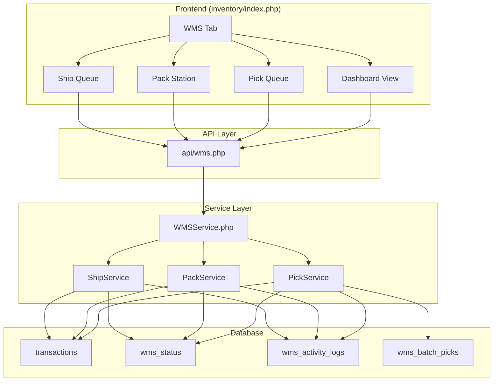
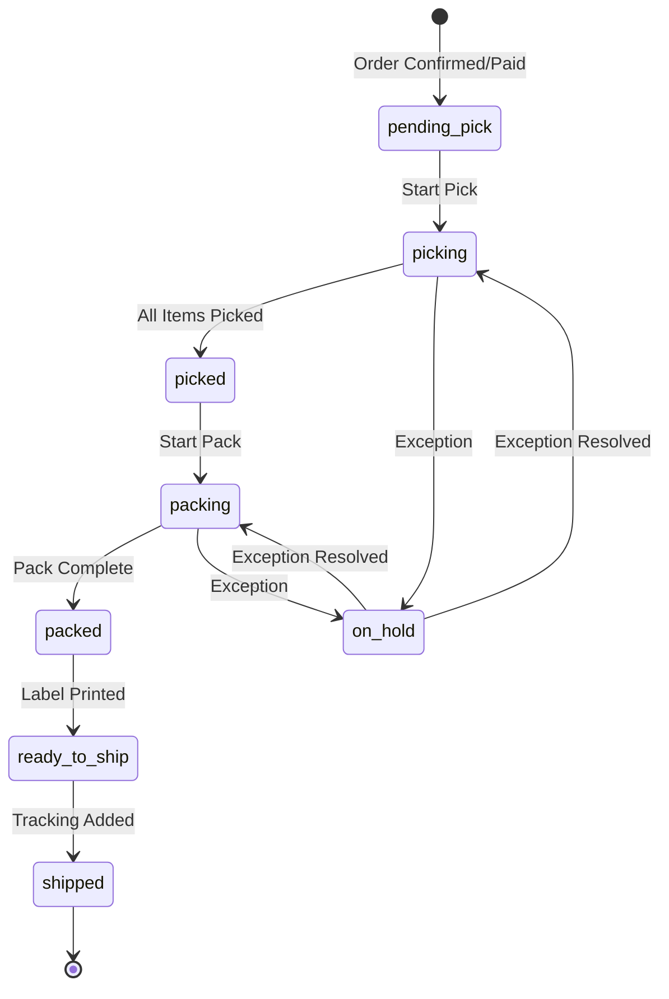

# Design Document: Pick-Pack-Ship (WMS)

## Overview

ระบบ Pick-Pack-Ship เป็นส่วนขยายของระบบ Inventory Management ที่จัดการกระบวนการ fulfillment ตั้งแต่รับออเดอร์จนถึงส่งมอบให้ขนส่ง โดยแบ่งเป็น 3 ขั้นตอนหลัก:

1. **Pick** - หยิบสินค้าจากคลังตามรายการออเดอร์
2. **Pack** - แพ็คสินค้าลงกล่อง/ซอง พร้อมพิมพ์เอกสาร
3. **Ship** - ส่งมอบให้ขนส่งและบันทึกเลขพัสดุ

ระบบจะถูกเพิ่มเป็น tab ใหม่ในหน้า `/inventory` เพื่อให้เข้าถึงได้ง่ายจากเมนูคลังสินค้า

## Architecture



## Components and Interfaces

### 1. WMS Tab Component (`includes/inventory/wms.php`)

Tab content สำหรับแสดงใน inventory page:

```php
interface WMSTabInterface {
    // Sub-tabs within WMS
    public function renderDashboard(): string;
    public function renderPickQueue(): string;
    public function renderPackStation(): string;
    public function renderShipQueue(): string;
    public function renderExceptions(): string;
}
```

### 2. WMS Service (`classes/WMSService.php`)

Service หลักสำหรับจัดการ WMS operations:

```php
interface WMSServiceInterface {
    // Pick operations
    public function getPickQueue(int $lineAccountId): array;
    public function startPicking(int $orderId, int $pickerId): bool;
    public function confirmItemPicked(int $orderId, int $itemId): bool;
    public function completePicking(int $orderId): bool;
    
    // Batch pick operations
    public function createBatchPick(array $orderIds): int;
    public function getBatchPickList(int $batchId): array;
    public function completeBatchPick(int $batchId): bool;
    
    // Pack operations
    public function getPackQueue(int $lineAccountId): array;
    public function startPacking(int $orderId, int $packerId): bool;
    public function completePacking(int $orderId, ?array $packageInfo): bool;
    
    // Ship operations
    public function getShipQueue(int $lineAccountId): array;
    public function assignCarrier(int $orderId, string $carrier, string $trackingNumber): bool;
    public function confirmShipped(int $orderId): bool;
    
    // Dashboard
    public function getDashboardStats(int $lineAccountId): array;
    public function getOverdueOrders(int $lineAccountId, int $slaHours = 24): array;
    
    // Exceptions
    public function markItemShort(int $orderId, int $itemId, string $reason): bool;
    public function markItemDamaged(int $orderId, int $itemId, string $reason): bool;
    public function putOrderOnHold(int $orderId, string $reason): bool;
    public function resolveException(int $orderId, string $resolution, int $staffId): bool;
}
```

### 3. WMS API (`api/wms.php`)

REST API endpoints:

| Action | Method | Description |
|--------|--------|-------------|
| `get_pick_queue` | GET | Get orders pending pick |
| `start_pick` | POST | Start picking an order |
| `confirm_item_picked` | POST | Mark item as picked |
| `complete_pick` | POST | Complete picking for order |
| `create_batch_pick` | POST | Create batch pick from orders |
| `get_pack_queue` | GET | Get orders ready for packing |
| `start_pack` | POST | Start packing an order |
| `complete_pack` | POST | Complete packing |
| `get_ship_queue` | GET | Get orders ready to ship |
| `assign_tracking` | POST | Assign carrier and tracking |
| `confirm_shipped` | POST | Mark as shipped |
| `get_dashboard` | GET | Get dashboard statistics |
| `get_exceptions` | GET | Get orders with exceptions |
| `resolve_exception` | POST | Resolve an exception |
| `print_packing_slip` | GET | Generate packing slip PDF |
| `print_shipping_label` | GET | Generate shipping label |

### 4. Print Service (`classes/WMSPrintService.php`)

Service สำหรับสร้างเอกสาร:

```php
interface WMSPrintServiceInterface {
    public function generatePackingSlip(int $orderId): string; // Returns HTML
    public function generateShippingLabel(int $orderId): string; // Returns HTML
    public function generateBatchPackingSlips(array $orderIds): string; // Returns HTML for multiple
    public function generateBatchLabels(array $orderIds): string;
}
```

## Data Models

### WMS Status Extension (transactions table)

เพิ่ม fields ใน transactions table:

```sql
ALTER TABLE transactions ADD COLUMN wms_status ENUM(
    'pending_pick',
    'picking',
    'picked',
    'packing',
    'packed',
    'ready_to_ship',
    'shipped'
) DEFAULT NULL;

ALTER TABLE transactions ADD COLUMN picker_id INT NULL;
ALTER TABLE transactions ADD COLUMN packer_id INT NULL;
ALTER TABLE transactions ADD COLUMN pick_started_at DATETIME NULL;
ALTER TABLE transactions ADD COLUMN pick_completed_at DATETIME NULL;
ALTER TABLE transactions ADD COLUMN pack_started_at DATETIME NULL;
ALTER TABLE transactions ADD COLUMN pack_completed_at DATETIME NULL;
ALTER TABLE transactions ADD COLUMN shipped_at DATETIME NULL;
ALTER TABLE transactions ADD COLUMN carrier VARCHAR(50) NULL;
ALTER TABLE transactions ADD COLUMN package_weight DECIMAL(10,2) NULL;
ALTER TABLE transactions ADD COLUMN package_dimensions VARCHAR(50) NULL;
ALTER TABLE transactions ADD COLUMN wms_exception VARCHAR(255) NULL;
ALTER TABLE transactions ADD COLUMN wms_exception_resolved_at DATETIME NULL;
ALTER TABLE transactions ADD COLUMN wms_exception_resolved_by INT NULL;
```

### WMS Activity Logs Table

```sql
CREATE TABLE wms_activity_logs (
    id INT AUTO_INCREMENT PRIMARY KEY,
    line_account_id INT NOT NULL,
    order_id INT NOT NULL,
    action ENUM('pick_started', 'item_picked', 'pick_completed', 
                'pack_started', 'pack_completed', 
                'label_printed', 'shipped',
                'item_short', 'item_damaged', 'on_hold', 'exception_resolved') NOT NULL,
    item_id INT NULL,
    staff_id INT NULL,
    notes TEXT NULL,
    created_at DATETIME DEFAULT CURRENT_TIMESTAMP,
    
    INDEX idx_order (order_id),
    INDEX idx_line_account (line_account_id),
    INDEX idx_action (action),
    INDEX idx_created (created_at)
);
```

### WMS Batch Picks Table

```sql
CREATE TABLE wms_batch_picks (
    id INT AUTO_INCREMENT PRIMARY KEY,
    line_account_id INT NOT NULL,
    batch_number VARCHAR(20) NOT NULL,
    status ENUM('pending', 'in_progress', 'completed', 'cancelled') DEFAULT 'pending',
    picker_id INT NULL,
    created_at DATETIME DEFAULT CURRENT_TIMESTAMP,
    started_at DATETIME NULL,
    completed_at DATETIME NULL,
    
    UNIQUE KEY uk_batch_number (batch_number),
    INDEX idx_line_account (line_account_id),
    INDEX idx_status (status)
);

CREATE TABLE wms_batch_pick_orders (
    id INT AUTO_INCREMENT PRIMARY KEY,
    batch_id INT NOT NULL,
    order_id INT NOT NULL,
    
    FOREIGN KEY (batch_id) REFERENCES wms_batch_picks(id),
    UNIQUE KEY uk_batch_order (batch_id, order_id)
);
```

### WMS Status Flow



## Correctness Properties

*A property is a characteristic or behavior that should hold true across all valid executions of a system-essentially, a formal statement about what the system should do. Properties serve as the bridge between human-readable specifications and machine-verifiable correctness guarantees.*

### Property 1: Pick queue contains only confirmed/paid orders
*For any* line account, all orders in the pick queue should have status 'confirmed' or 'paid' and wms_status 'pending_pick'
**Validates: Requirements 1.1**

### Property 2: Pick queue sorting by date
*For any* pick queue, orders should be sorted by created_at ascending (oldest first)
**Validates: Requirements 1.2**

### Property 3: Status transition on pick start
*For any* order, when picking starts, the wms_status should change to 'picking' and picker_id should be set
**Validates: Requirements 1.3**

### Property 4: All items picked triggers status change
*For any* order, when all items are marked as picked, the wms_status should automatically change to 'picked'
**Validates: Requirements 1.6**

### Property 5: Batch pick consolidation
*For any* batch pick, items with the same product_id from different orders should be grouped together with total quantity
**Validates: Requirements 2.1, 2.2**

### Property 6: Batch pick distribution
*For any* completed batch pick, items should be correctly distributed back to their original orders
**Validates: Requirements 2.3**

### Property 7: Pack validation
*For any* order at pack station, packing should only be allowed if all items are in 'picked' status
**Validates: Requirements 3.2**

### Property 8: Pack completion status transition
*For any* order, when packing is complete, wms_status should change to 'packed'
**Validates: Requirements 3.5**

### Property 9: Shipping label contains required fields
*For any* shipping label, it should contain recipient name, address, order number, and sender information
**Validates: Requirements 4.1, 4.2**

### Property 10: Tracking number triggers shipped status
*For any* order, when tracking number is added, wms_status should change to 'shipped' and status should change to 'shipping'
**Validates: Requirements 5.3, 7.4**

### Property 11: Dashboard counts accuracy
*For any* dashboard view, the count for each wms_status should match the actual count of orders with that status
**Validates: Requirements 6.1**

### Property 12: WMS to customer status mapping
*For any* wms_status change, the customer-facing status should be updated according to the mapping:
- picking → processing
- packed → ready_to_ship  
- shipped → shipping
**Validates: Requirements 7.2, 7.3, 7.4**

### Property 13: Exception handling creates log
*For any* exception (short, damaged, on_hold), an activity log entry should be created with the reason
**Validates: Requirements 9.1, 9.2**

### Property 14: Data serialization round-trip
*For any* WMS data, serializing to JSON then deserializing should produce equivalent data
**Validates: Requirements 10.3**

## Error Handling

| Error Scenario | Handling |
|----------------|----------|
| Order not found | Return 404 with message |
| Invalid status transition | Return 400 with allowed transitions |
| Item already picked | Return 409 conflict |
| Insufficient stock during pick | Allow marking as 'short', create exception |
| Missing required fields | Return 400 with validation errors |
| Database error | Log error, return 500 |
| Concurrent modification | Use optimistic locking with version field |

## Testing Strategy

### Unit Tests
- Test WMSService methods individually
- Test status transition logic
- Test batch pick consolidation/distribution
- Test dashboard statistics calculation

### Property-Based Tests
Using PHPUnit with data providers for property-based testing:

1. **Pick queue property test** - Generate random orders, verify queue contains only valid orders
2. **Status transition property test** - Generate random status changes, verify transitions are valid
3. **Batch pick property test** - Generate random orders, verify consolidation and distribution
4. **Dashboard accuracy property test** - Generate random orders, verify counts match
5. **Serialization round-trip test** - Generate random WMS data, verify round-trip produces equivalent data

### Integration Tests
- Test full pick-pack-ship flow
- Test API endpoints with database
- Test LINE notification integration
