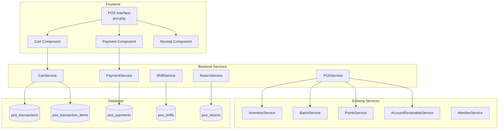

# Design Document: POS System

## Overview

ระบบ POS (Point of Sale) สำหรับขายสินค้าหน้าร้านขายยา พัฒนาเป็น Web-based Application ใช้งานบน Tablet/PC รองรับการทำงานแบบ Real-time เชื่อมต่อกับระบบ Inventory, Accounting, CRM และ Points ที่มีอยู่

### Key Features
- หน้าจอขายที่ใช้งานง่าย รวดเร็ว
- รองรับหลายวิธีชำระเงิน (เงินสด, โอน, บัตร, แต้ม)
- ตัด Stock อัตโนมัติแบบ FEFO
- ระบบ Shift Management
- Return/Refund พร้อม Audit Trail
- รายงานยอดขายประจำวัน

## Architecture



## Components and Interfaces

### 1. POSService (classes/POSService.php)

Main service orchestrating POS operations.

```php
class POSService {
    // Transaction Management
    public function createTransaction(int $cashierId, ?int $customerId = null): array;
    public function completeTransaction(int $transactionId, array $payments): array;
    public function voidTransaction(int $transactionId, string $reason, int $authorizedBy): bool;
    
    // Cart Operations
    public function addToCart(int $transactionId, int $productId, int $quantity): array;
    public function updateCartItem(int $itemId, int $quantity): array;
    public function removeFromCart(int $itemId): bool;
    public function applyItemDiscount(int $itemId, string $type, float $value): array;
    public function applyBillDiscount(int $transactionId, string $type, float $value): array;
    
    // Customer
    public function setCustomer(int $transactionId, int $customerId): array;
    public function searchCustomers(string $query): array;
    
    // Calculations
    public function calculateTotals(int $transactionId): array;
}
```

### 2. PaymentService (classes/POSPaymentService.php)

Handles payment processing.

```php
class POSPaymentService {
    public function processPayment(int $transactionId, array $paymentData): array;
    public function processSplitPayment(int $transactionId, array $payments): array;
    public function processPointsRedemption(int $transactionId, int $points): array;
    public function calculateChange(float $totalAmount, float $cashReceived): float;
    public function processRefund(int $returnId, string $method): array;
}
```

### 3. ShiftService (classes/POSShiftService.php)

Manages cashier shifts.

```php
class POSShiftService {
    public function openShift(int $cashierId, float $openingCash): array;
    public function closeShift(int $shiftId, float $closingCash): array;
    public function getCurrentShift(int $cashierId): ?array;
    public function getShiftSummary(int $shiftId): array;
    public function calculateVariance(int $shiftId, float $actualCash): array;
}
```

### 4. ReturnService (classes/POSReturnService.php)

Handles returns and refunds.

```php
class POSReturnService {
    public function findTransaction(string $receiptNumber): ?array;
    public function createReturn(int $originalTransactionId, array $items, string $reason): array;
    public function processReturn(int $returnId, int $authorizedBy): array;
    public function getReturnableItems(int $transactionId): array;
}
```

### 5. ReceiptService (classes/POSReceiptService.php)

Generates receipts.

```php
class POSReceiptService {
    public function generateReceipt(int $transactionId): array;
    public function printReceipt(int $transactionId): bool;
    public function sendLineReceipt(int $transactionId, string $lineUserId): bool;
    public function generateReturnReceipt(int $returnId): array;
}
```

## Data Models

### pos_transactions
```sql
CREATE TABLE pos_transactions (
    id INT PRIMARY KEY AUTO_INCREMENT,
    line_account_id INT,
    transaction_number VARCHAR(50) UNIQUE NOT NULL,
    shift_id INT NOT NULL,
    cashier_id INT NOT NULL,
    customer_id INT NULL,
    customer_type ENUM('walk_in', 'member') DEFAULT 'walk_in',
    
    -- Amounts
    subtotal DECIMAL(12,2) DEFAULT 0,
    discount_type ENUM('percent', 'fixed') NULL,
    discount_value DECIMAL(12,2) DEFAULT 0,
    discount_amount DECIMAL(12,2) DEFAULT 0,
    vat_amount DECIMAL(12,2) DEFAULT 0,
    total_amount DECIMAL(12,2) DEFAULT 0,
    
    -- Points
    points_earned INT DEFAULT 0,
    points_redeemed INT DEFAULT 0,
    points_value DECIMAL(12,2) DEFAULT 0,
    
    -- Status
    status ENUM('draft', 'completed', 'voided') DEFAULT 'draft',
    voided_at DATETIME NULL,
    voided_by INT NULL,
    void_reason VARCHAR(255) NULL,
    
    -- Timestamps
    created_at DATETIME DEFAULT CURRENT_TIMESTAMP,
    completed_at DATETIME NULL,
    
    INDEX idx_shift (shift_id),
    INDEX idx_cashier (cashier_id),
    INDEX idx_customer (customer_id),
    INDEX idx_status (status),
    INDEX idx_date (created_at)
);
```

### pos_transaction_items
```sql
CREATE TABLE pos_transaction_items (
    id INT PRIMARY KEY AUTO_INCREMENT,
    transaction_id INT NOT NULL,
    product_id INT NOT NULL,
    batch_id INT NULL,
    
    -- Quantities
    quantity INT NOT NULL,
    returned_quantity INT DEFAULT 0,
    
    -- Pricing
    unit_price DECIMAL(12,2) NOT NULL,
    cost_price DECIMAL(12,2) NULL,
    discount_type ENUM('percent', 'fixed') NULL,
    discount_value DECIMAL(12,2) DEFAULT 0,
    discount_amount DECIMAL(12,2) DEFAULT 0,
    line_total DECIMAL(12,2) NOT NULL,
    
    created_at DATETIME DEFAULT CURRENT_TIMESTAMP,
    
    FOREIGN KEY (transaction_id) REFERENCES pos_transactions(id),
    INDEX idx_product (product_id)
);
```

### pos_payments
```sql
CREATE TABLE pos_payments (
    id INT PRIMARY KEY AUTO_INCREMENT,
    transaction_id INT NOT NULL,
    payment_method ENUM('cash', 'transfer', 'card', 'points', 'credit') NOT NULL,
    amount DECIMAL(12,2) NOT NULL,
    
    -- Cash specific
    cash_received DECIMAL(12,2) NULL,
    change_amount DECIMAL(12,2) NULL,
    
    -- Transfer/Card specific
    reference_number VARCHAR(100) NULL,
    
    -- Points specific
    points_used INT NULL,
    
    created_at DATETIME DEFAULT CURRENT_TIMESTAMP,
    
    FOREIGN KEY (transaction_id) REFERENCES pos_transactions(id),
    INDEX idx_method (payment_method)
);
```

### pos_shifts
```sql
CREATE TABLE pos_shifts (
    id INT PRIMARY KEY AUTO_INCREMENT,
    line_account_id INT,
    cashier_id INT NOT NULL,
    shift_number VARCHAR(50) UNIQUE NOT NULL,
    
    -- Cash tracking
    opening_cash DECIMAL(12,2) NOT NULL,
    closing_cash DECIMAL(12,2) NULL,
    expected_cash DECIMAL(12,2) NULL,
    variance DECIMAL(12,2) NULL,
    
    -- Summary
    total_sales DECIMAL(12,2) DEFAULT 0,
    total_transactions INT DEFAULT 0,
    total_refunds DECIMAL(12,2) DEFAULT 0,
    
    -- Status
    status ENUM('open', 'closed') DEFAULT 'open',
    opened_at DATETIME DEFAULT CURRENT_TIMESTAMP,
    closed_at DATETIME NULL,
    
    INDEX idx_cashier (cashier_id),
    INDEX idx_status (status)
);
```

### pos_returns
```sql
CREATE TABLE pos_returns (
    id INT PRIMARY KEY AUTO_INCREMENT,
    line_account_id INT,
    return_number VARCHAR(50) UNIQUE NOT NULL,
    original_transaction_id INT NOT NULL,
    shift_id INT NOT NULL,
    
    -- Amounts
    total_amount DECIMAL(12,2) NOT NULL,
    refund_amount DECIMAL(12,2) NOT NULL,
    refund_method ENUM('cash', 'original', 'credit') NOT NULL,
    
    -- Points reversal
    points_deducted INT DEFAULT 0,
    
    -- Details
    reason VARCHAR(255) NOT NULL,
    processed_by INT NOT NULL,
    authorized_by INT NULL,
    
    -- Status
    status ENUM('pending', 'completed', 'cancelled') DEFAULT 'pending',
    created_at DATETIME DEFAULT CURRENT_TIMESTAMP,
    completed_at DATETIME NULL,
    
    FOREIGN KEY (original_transaction_id) REFERENCES pos_transactions(id),
    INDEX idx_original (original_transaction_id)
);
```

### pos_return_items
```sql
CREATE TABLE pos_return_items (
    id INT PRIMARY KEY AUTO_INCREMENT,
    return_id INT NOT NULL,
    original_item_id INT NOT NULL,
    product_id INT NOT NULL,
    quantity INT NOT NULL,
    unit_price DECIMAL(12,2) NOT NULL,
    line_total DECIMAL(12,2) NOT NULL,
    
    FOREIGN KEY (return_id) REFERENCES pos_returns(id),
    FOREIGN KEY (original_item_id) REFERENCES pos_transaction_items(id)
);
```

## Correctness Properties

*A property is a characteristic or behavior that should hold true across all valid executions of a system-essentially, a formal statement about what the system should do. Properties serve as the bridge between human-readable specifications and machine-verifiable correctness guarantees.*

### Property 1: Cart Calculation Consistency
*For any* cart with items, the cart total SHALL equal the sum of all line totals minus bill discount, where each line total equals (quantity × unit_price) minus line discount.
**Validates: Requirements 1.3, 1.4, 3.1, 3.2, 3.3**

### Property 2: Stock Quantity Constraint
*For any* product added to cart, the cart quantity SHALL never exceed the available stock quantity.
**Validates: Requirements 1.5**

### Property 3: Expired Product Exclusion
*For any* cart, no item SHALL have an expiry date before the current date.
**Validates: Requirements 1.6**

### Property 4: Discount Cap Enforcement
*For any* discount applied, the resulting price SHALL never be negative (discount capped at item/bill total).
**Validates: Requirements 3.4**

### Property 5: Payment Balance Consistency
*For any* completed transaction, the sum of all payments SHALL equal the total amount.
**Validates: Requirements 4.5, 4.7**

### Property 6: Change Calculation Accuracy
*For any* cash payment, change amount SHALL equal cash received minus total amount (when cash >= total).
**Validates: Requirements 4.1, 4.2**

### Property 7: Receipt Content Completeness
*For any* generated receipt, it SHALL contain: store info, all items with prices, subtotal, discounts, VAT, total, payment method(s), and transaction number.
**Validates: Requirements 5.5**

### Property 8: Stock Movement Consistency
*For any* completed sale, stock SHALL decrease by sold quantity; for any void/return, stock SHALL increase by returned quantity.
**Validates: Requirements 6.1, 6.3, 12.5**

### Property 9: FEFO Batch Selection
*For any* stock deduction, batches SHALL be selected in order of earliest expiry date first.
**Validates: Requirements 6.2**

### Property 10: Shift Cash Variance Calculation
*For any* closed shift, variance SHALL equal actual closing cash minus expected cash (opening + cash sales - cash refunds).
**Validates: Requirements 7.3**

### Property 11: Shift Sales Prevention
*For any* cashier without an open shift, the system SHALL reject all sale transactions.
**Validates: Requirements 7.5**

### Property 12: Void Reversal Completeness
*For any* voided transaction, all related records (stock movements, points, payments) SHALL be reversed.
**Validates: Requirements 8.4**

### Property 13: Points Calculation Consistency
*For any* member purchase, points earned SHALL equal floor(total_amount / points_rate); for any void/return, points SHALL be deducted proportionally.
**Validates: Requirements 10.1, 10.2, 10.4, 12.7**

### Property 14: Points Redemption Validity
*For any* points redemption, redeemed points SHALL not exceed member's available balance.
**Validates: Requirements 10.3**

### Property 15: Return Quantity Constraint
*For any* return item, return quantity SHALL not exceed (original quantity - already returned quantity).
**Validates: Requirements 12.3**

### Property 16: Return Transaction Linkage
*For any* return, it SHALL be linked to exactly one original transaction and contain valid reference.
**Validates: Requirements 12.10**

### Property 17: Daily Report Accuracy
*For any* daily report, total sales SHALL equal sum of all completed transactions; transaction count SHALL match actual count.
**Validates: Requirements 9.1, 9.2**

## Error Handling

### Transaction Errors
- **Insufficient Stock**: Display warning, prevent adding more than available
- **Expired Product**: Block addition, show expiry warning
- **Payment Mismatch**: Prevent completion until payments equal total
- **No Open Shift**: Block all sales, prompt to open shift

### Return Errors
- **Invalid Receipt**: Display "Receipt not found" message
- **Already Returned**: Show remaining returnable quantity
- **Time Limit Exceeded**: Require manager authorization
- **Insufficient Points**: Block return if member has negative points after deduction

### System Errors
- **Database Connection**: Show offline mode option, queue transactions
- **Printer Error**: Allow retry or skip printing
- **Network Error**: Cache transaction locally, sync when online

## Testing Strategy

### Unit Testing
- Test calculation functions (totals, discounts, change, VAT)
- Test validation functions (stock check, expiry check, quantity limits)
- Test state transitions (draft → completed → voided)

### Property-Based Testing
Using PHPUnit with data providers for property-based tests:

1. **Cart Calculation Tests**: Generate random carts, verify total calculations
2. **Stock Constraint Tests**: Generate random quantities, verify stock limits
3. **Payment Tests**: Generate random payment combinations, verify balance
4. **Points Tests**: Generate random purchases, verify points calculations
5. **Return Tests**: Generate random returns, verify quantity constraints

### Integration Testing
- Test full sale flow: add items → apply discount → payment → receipt
- Test return flow: find receipt → select items → process refund
- Test shift flow: open → sales → close → verify variance
- Test inventory integration: sale → stock deduction → movement record
